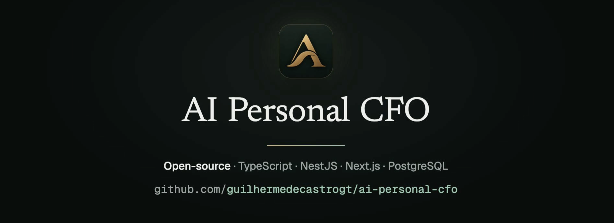
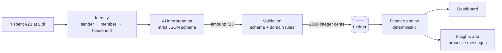
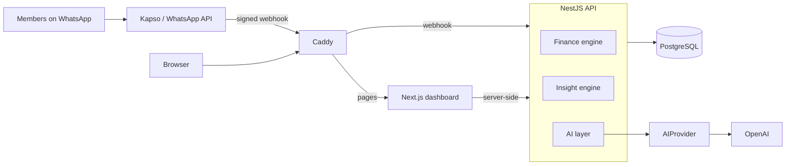

<p align="center">
  
</p>

<p align="center">
  <a href="https://github.com/guilhermedecastrogt/ai-personal-cfo/actions/workflows/ci.yml"></a>
  <a href="LICENSE"></a>
  
  
</p>

<p align="center"><b>AI understands your money. Code controls the numbers.</b></p>

A household finance assistant you use over WhatsApp. Each member writes to one shared number from their own phone. A message like `I spent €23 at Lidl`, or a photo of a receipt, becomes a structured transaction attributed to whoever sent it and counted against the household's budgets and goals. A web dashboard shows the whole picture, and the assistant speaks up on its own when something needs attention.

It is a personal project built in the open: multi-household, multi-member, self-hosted, and not offered as a service.

## How it works



1. **Identity before intelligence.** The WhatsApp sender is resolved to a member and a household from a signed webhook, before any model is called.
2. **The model reads, it doesn't decide.** It returns structured fields through a strict JSON schema. The amount comes back as text, never as a number, and the whole output is treated as untrusted input.
3. **Code turns language into money.** Every field is validated against the domain. `parseMoney("23", "EUR")` becomes `2300` integer cents with `BigInt` arithmetic. When anything is uncertain, the assistant asks instead of guessing.
4. **A deterministic engine is the source of truth.** Balances, budgets, cash flow, forecasts and goal progress are plain code over one ledger: same ledger, same date, same result.
5. **The model can't invent a number.** Every figure in an AI-written reply must exist in the facts the engine produced. If one doesn't, the reply is discarded and a deterministic one is sent.

## Features

| Area               | What it does                                                                                                                                                                                                     |
| ------------------ | ---------------------------------------------------------------------------------------------------------------------------------------------------------------------------------------------------------------- |
| **WhatsApp**       | Record spending and income in plain text or with a receipt photo; several transactions in one message; correct or delete from the chat; ask questions such as "how much did we spend on restaurants this month?" |
| **Finance engine** | Balances, budgets with pace and forecasts, cash flow, goals with linked contributions, recurring-expense detection, month-over-month comparison                                                                  |
| **Proactive CFO**  | An hourly evaluation finds risks such as a budget projected to run over; a fixed policy (quiet hours, cooldown, daily cap) decides what is sent                                                                  |
| **Dashboard**      | Overview, spending, income, budgets, goals, outlook, recurring, signals, monthly review, per-member pages, month comparison, search and CSV export, editing                                                      |
| **Households**     | Shared finances per household with per-member attribution; `household_id` on every row and composite keys that keep references inside it                                                                         |
| **Administration** | Platform admins create households, manage member access and send a WhatsApp welcome, without seeing any household's money                                                                                        |

## Architecture

A modular monolith, deployed as one Docker Compose stack on a single ARM64 VM.



- **The AI is one module.** Only the AI layer talks to a model, and only through the `AIProvider` interface.
- **The dashboard calculates nothing.** It renders figures the API already computed and formatted. Architecture tests enforce this and the other module boundaries.
- **Only the API reaches the database.** Caddy forwards only the WhatsApp webhook to the API; everything else goes to the web application.

The full design is in [docs/architecture.md](docs/architecture.md), with the reasoning behind each decision in the [architecture decision records](docs/adr/README.md).

## Tech stack

| Area           | Choice                                                                           |
| -------------- | -------------------------------------------------------------------------------- |
| Backend        | Node.js 22, TypeScript, NestJS, Drizzle ORM, Zod                                 |
| Frontend       | Next.js, React, Tailwind CSS                                                     |
| Database       | PostgreSQL                                                                       |
| AI             | OpenAI behind an internal `AIProvider` interface                                 |
| Messaging      | WhatsApp through Kapso                                                           |
| Infrastructure | Docker Compose, Caddy, Terraform, Oracle Cloud ARM64                             |
| Quality        | Jest, Testing Library, integration tests against real PostgreSQL, GitHub Actions |

## Getting started

Requires Node.js 22 and Docker.

```sh
npm install
docker compose -f docker-compose.dev.yml up -d --wait
cp apps/api/.env.example apps/api/.env
npm run db:migrate --workspace apps/api
npm run db:seed --workspace apps/api
npm run start:dev --workspace apps/api
npm run dev --workspace apps/web
```

The API listens on port 3000 and the dashboard on port 3001. The seed creates a fictional demo household. To sign in, issue an access code as described in the [dashboard guide](docs/web-dashboard.md). The [development guide](docs/development.md) covers every command and convention.

```sh
npm run lint && npm run typecheck && npm test
npm run test:integration --workspace apps/api   # needs the dev PostgreSQL
```

## Deployment and cost

The production stack (Caddy, web, API, PostgreSQL) runs on one ARM64 VM. GitHub Actions builds the images, tags them with the commit SHA and deploys after CI passes. Terraform manages only the network rule the stack needs.

The stack fits Oracle Cloud's Always Free ARM tier, and WhatsApp can run on Kapso's free plan with the number they provide, so the infrastructure itself can cost nothing. Model calls are billed by OpenAI, and Meta bills business-initiated templates such as the welcome message.

| Guide                                            | Covers                                                                         |
| ------------------------------------------------ | ------------------------------------------------------------------------------ |
| [Infrastructure](docs/infrastructure.md)         | Layout, resource limits, host requirements, network and DNS                    |
| [Deployment](docs/deployment.md)                 | CI, the deploy workflow, first-time setup, configuration, migrations, rollback |
| [Operations](docs/operations.md)                 | Health, logs, diagnosing failures, one-off commands, platform admins           |
| [Backup and restore](docs/backup-and-restore.md) | Schedule, off-machine copies, restore procedures                               |
| [Security](docs/security.md)                     | Threat model, authentication, isolation, what is not covered                   |

## Repository layout

```
apps/
  api/          NestJS backend: finance engine, AI layer, WhatsApp, dashboard API, platform admin
  web/          Next.js dashboard
infra/
  docker/       Compose stack, Caddy and deploy scripts
  terraform/    Oracle Cloud network rule
docs/           Architecture, guides and decision records
```

## Roadmap

- [x] Finance engine, ledger and household model
- [x] WhatsApp conversations: text, receipts, corrections, follow-up questions
- [x] Insight engine, monthly review and proactive notifications
- [x] Recurring expenses and goal contributions
- [x] Dashboard with editing, charts, comparison and CSV export
- [x] Platform administration and WhatsApp welcome
- [x] Deployment infrastructure and security hardening
- [ ] Monthly reports
- [ ] Installments
- [ ] Per-member budgets

Out of scope: open banking and bank synchronization, permanent receipt storage, investment tracking, currency conversion, expense splitting and private per-member finances.

## Contributing and security

Issues and pull requests are welcome; see [CONTRIBUTING.md](CONTRIBUTING.md). Report vulnerabilities privately as described in [SECURITY.md](SECURITY.md).

## License

[MIT](LICENSE) © Guilherme de Castro
