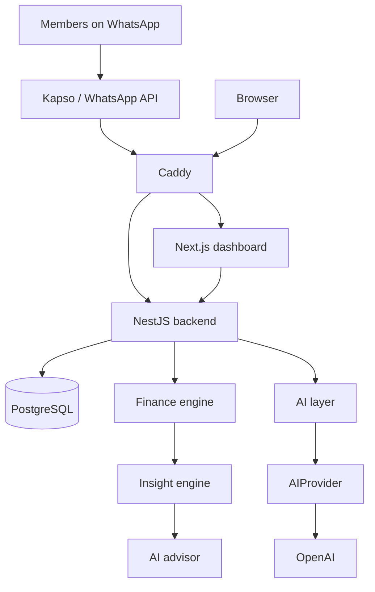

# AI Personal CFO

An open-source, multi-household, multi-member personal finance platform, used over WhatsApp. Each member writes to one shared assistant number from their own phone. A message such as `I spent €23 at Lidl`, or a photo of a receipt, becomes a structured transaction attributed to the person who sent it, tracked against the household's budgets and goals. The assistant speaks up when something deserves attention.

This is a personal project built in the open. A household can have one member, two, or more, and the application can hold several independent households. Its first real use is a couple. It is self-hosted and is not offered as a service.

## Status

Early development. The repository currently contains the project skeleton and documentation only. Nothing described below is implemented yet; see the [roadmap](#roadmap) for the build order.

## Design principles

- **The finance engine is deterministic.** Balances, budgets, forecasts and goal progress are computed by plain code over integer minor units. A language model never performs a financial calculation.
- **AI is an interface and an advisor, not the source of truth.** Models extract structured data from messages and images and explain verified figures. Every model output passes runtime and domain validation before anything is persisted.
- **The household is the unit of finance.** Accounts, transactions, budgets, goals and reports belong to the household and are fully shared between its members. Each transaction records which member it is attributed to, so the same data answers both "how much did we spend" and "how much did I spend".
- **Identity is looked up, never inferred.** The sender of a WhatsApp message is resolved to a household member from the provider's sender identifier before any model is involved.
- **Ask instead of guessing.** When an amount, category or interpretation is uncertain, the system asks the user.
- **Structured data only.** Receipt images are processed in a temporary location and discarded. Only the extracted transaction is stored.
- **One machine, one deployable.** A modular monolith running under Docker Compose on a single ARM64 VM.

## Architecture



## Tech stack

| Area           | Choice                                                             |
| -------------- | ------------------------------------------------------------------ |
| Backend        | Node.js, TypeScript, NestJS, Drizzle ORM, Zod, Jest                |
| Database       | PostgreSQL                                                         |
| AI             | OpenAI, isolated behind an internal `AIProvider` interface         |
| Frontend       | Next.js, TypeScript, Tailwind CSS, Recharts                        |
| Infrastructure | Docker Compose, Caddy, Terraform, Oracle Cloud Always Free (ARM64) |
| CI             | GitHub Actions                                                     |

## Repository layout

```
apps/
  api/          NestJS backend
  web/          Next.js dashboard
infra/
  terraform/    Oracle Cloud provisioning
docs/           Architecture, guides and decision records
```

## Local development

Requires Node.js 22 and Docker.

```sh
npm install
docker compose -f docker-compose.dev.yml up -d --wait
cp apps/api/.env.example apps/api/.env
npm run db:migrate --workspace apps/api
npm run db:seed --workspace apps/api
npm run start:dev --workspace apps/api
npm run dev --workspace apps/web
```

The API listens on port 3000 and the dashboard on port 3001. To sign in to the dashboard, issue an access code for a member as described in the [dashboard guide](docs/web-dashboard.md). See the [development guide](docs/development.md) for the full set of commands and conventions.

## Roadmap

- [x] Repository initialization
- [x] Household, identity and AI provider decisions
- [x] Architecture documentation and decision records
- [x] Backend bootstrap with health and readiness checks
- [x] Database schema and core domain
- [x] Finance engine
- [x] AI transaction extraction from text and financial questions
- [x] AI transaction extraction from images
- [x] WhatsApp integration with webhook idempotency
- [x] Insight engine and monthly financial review
- [x] Multi-turn conversations with follow-up questions
- [x] Dashboard
- [x] Proactive notifications
- [x] Recurring expense and subscription intelligence
- [ ] Monthly reports
- [ ] Deployment infrastructure
- [x] Security hardening

Out of scope for the first version: open banking and bank synchronization, permanent receipt storage, PDF statements, investment tracking, net worth history, currency conversion, expense splitting between members, private per-member data, self-service household sign-up and a mobile application.

## Documentation

See the [architecture document](docs/architecture.md), the rest of [docs/](docs/README.md) and the [architecture decision records](docs/adr/README.md).

## License

[MIT](LICENSE)
