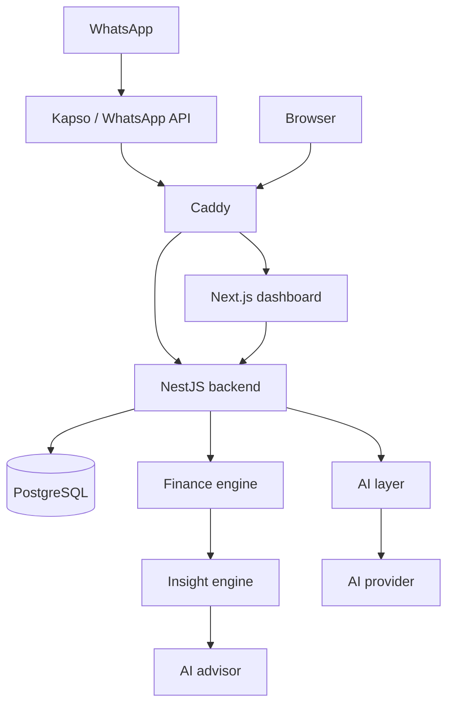

# AI Personal CFO

An open-source personal finance manager that you talk to over WhatsApp. You send a message such as `I spent €23 at Lidl`, or a photo of a receipt, and it records a structured transaction, tracks it against your budgets and goals, and tells you when something deserves your attention.

This is a personal project built in the open. It is designed for a single user and is not a hosted service.

## Status

Early development. The repository currently contains the project skeleton and documentation only. Nothing described below is implemented yet; see the [roadmap](#roadmap) for the build order.

## Design principles

- **The finance engine is deterministic.** Balances, budgets, forecasts and goal progress are computed by plain code over integer minor units. A language model never performs a financial calculation.
- **AI is an interface and an advisor, not the source of truth.** Models extract structured data from messages and images and explain verified figures. Every model output passes runtime and domain validation before anything is persisted.
- **Ask instead of guessing.** When an amount, category or interpretation is uncertain, the system asks the user.
- **Structured data only.** Receipt images are processed in a temporary location and discarded. Only the extracted transaction is stored.
- **One machine, one deployable.** A modular monolith running under Docker Compose on a single ARM64 VM.

## Architecture



## Tech stack

| Area | Choice |
| --- | --- |
| Backend | Node.js, TypeScript, NestJS, Drizzle ORM, Zod, Jest |
| Database | PostgreSQL |
| Frontend | Next.js, TypeScript, Tailwind CSS, Recharts |
| Infrastructure | Docker Compose, Caddy, Terraform, Oracle Cloud Always Free (ARM64) |
| CI | GitHub Actions |

## Repository layout

```
apps/
  api/          NestJS backend
  web/          Next.js dashboard
infra/
  terraform/    Oracle Cloud provisioning
docs/           Architecture, guides and decision records
```

## Roadmap

- [x] Repository initialization
- [ ] Architecture documentation and decision records
- [ ] Backend bootstrap with health and readiness checks
- [ ] Database schema and core domain
- [ ] Finance engine
- [ ] AI transaction extraction from text
- [ ] AI transaction extraction from images
- [ ] WhatsApp integration with webhook idempotency
- [ ] Insight engine and AI advisor
- [ ] Dashboard
- [ ] Monthly reports
- [ ] Deployment infrastructure
- [ ] Security hardening

Out of scope for the first version: open banking and bank synchronization, permanent receipt storage, PDF statements, investment tracking, net worth history, currency conversion, multi-user accounts and a mobile application.

## Documentation

See [docs/](docs/README.md).

## License

[MIT](LICENSE)
