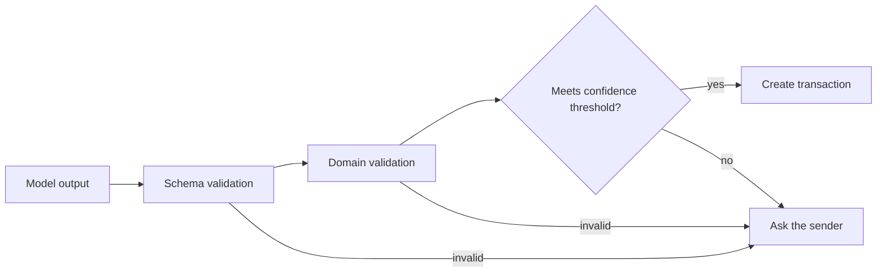

# ADR-004: AI output is validated before it reaches the domain

- Status: Accepted
- Date: 2026-10-05

## Context

Language models are what make it possible to turn "spent 23 at lidl" or a photographed receipt into a transaction. They are also capable of returning a wrong amount, a misread date or an invented merchant with complete fluency. Their input is free text and images written by people, which means it can contain instructions aimed at the model.

A finance system that writes whatever a model returns will accumulate errors that are hard to find later. A system that never acts without confirmation loses the convenience that justifies using a model.

## Decision

A model never writes to the database and never produces a figure that is presented as fact. Its output is treated like any other untrusted input.

**Extraction.** A model proposes a transaction. The application decides whether to accept it, through a fixed pipeline:

1. Structured output is requested against a schema, and the response is parsed against the same schema in the application.
2. Domain rules are applied: the amount is positive and converts exactly to minor units, the currency is known, the category exists, the date is plausible.
3. If required fields are present and the reported confidence meets a configured threshold, the transaction is created. Otherwise the sender is asked a specific question.

**What a model is not asked.** The household and the member come from identity resolution, never from the model ([ADR-007](ADR-007-whatsapp-identity-resolution.md)). Categories are chosen from the existing list, and a model cannot create one.

**Calculation.** Every sum, percentage, balance, trend and forecast is produced by the finance engine. A model receives those results as structured context and is asked to explain them.

**Questions.** A model answers questions by calling tools that return verified figures. Tool arguments are validated, and tools are bound to the sender's household by the application ([ADR-008](ADR-008-household-authorization-boundary.md)).

**Uncertainty.** A missing amount, low confidence or more than one reasonable interpretation each result in a question. No field is filled with a guess.

## Consequences

- A stored transaction has always passed deterministic validation, whatever produced it.
- Text in a message or image that tries to instruct the model can at most produce a proposed transaction or a tool call. Both are validated and both are confined to the sender's own household.
- Some messages cost an extra exchange because the system asks instead of assuming. The confidence threshold is configuration, so this trade-off can be tuned with experience.
- A model's self-reported confidence is a weak signal. It is one input next to hard checks on required fields and domain rules, and those checks do not depend on it.
- A plausible but wrong value that passes every rule, such as €32 read as €23, is still recorded. The confirmation reply always states what was recorded so the sender can catch it.
- Narrative text in advice and reports can still contain a misstatement. Passing figures as structured context and instructing the model to use only those reduces this without eliminating it. Numbers on the dashboard never pass through a model.
