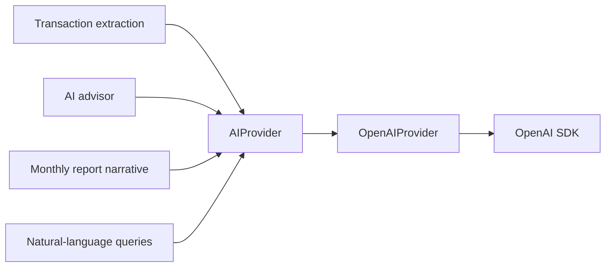

# ADR-005: OpenAI as the initial AI provider, behind an internal abstraction

- Status: Accepted
- Date: 2026-10-05

## Context

The system needs a language model for six jobs: extracting a structured transaction from a text message, extracting one from an image, answering natural-language questions about the household's finances, phrasing insights, writing the monthly review, and holding an advisory conversation.

A single vendor that covers text, vision and schema-constrained output keeps the integration small. At the same time, model vendors change pricing, models and APIs frequently, and a finance domain that imports a vendor SDK would have to change every time they do.

## Decision

OpenAI is the AI provider for the first version.

All access goes through an internal `AIProvider` interface with three capabilities: text generation, structured extraction and vision extraction. `OpenAIProvider` is its only implementation for now.

The rules that make the abstraction real:

- The OpenAI SDK is imported in exactly one module. No other module references OpenAI types, model names or error classes.
- The interface is expressed in the application's own types. Callers pass a Zod schema and receive a value of that schema's type, or a typed failure.
- Structured outputs are used wherever the model returns data rather than prose. The Zod schema is the single definition from which the provider request schema is derived.
- Every model response is parsed against its schema at runtime before it leaves the AI layer, even when the provider guarantees schema adherence. A response that fails parsing is a failure, never a partially trusted value.
- The finance engine does not depend on `AIProvider` at all. It is pure and deterministic, and the AI layer consumes its results, not the other way round.
- Model identifiers and the API key come from environment configuration.

## Consequences

- Replacing or adding a vendor means writing one class and changing one binding.
- Tests for extraction, advice and reports run against a fake `AIProvider`, so the suite needs no network access and no API key.
- The interface is limited to what the application needs. Vendor features outside the three capabilities are unavailable until the interface is deliberately extended.
- Schema validation runs twice on structured responses, once at the provider and once in the application. The duplication is intentional: the application's guarantee must not depend on a vendor's.
- Message text and receipt images are sent to a third party for processing. Images are still never persisted by this system.
