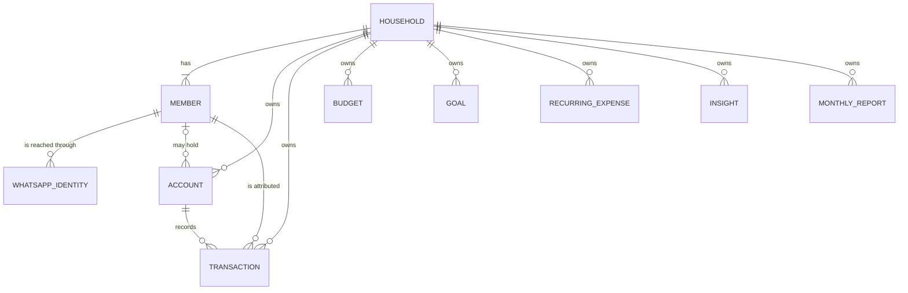

# ADR-006: Household as the financial scope, members for attribution

- Status: Accepted
- Date: 2026-10-05

## Context

The project was first described as a single-user tracker with a `user_id` on every record. Its real use is a couple managing their finances together through one WhatsApp number, each writing from their own phone.

Two questions follow. What owns the financial data, and what role does the individual person play? Scoping data to a person would make the common case, the combined picture, a cross-user aggregation and would push the design toward sharing rules. Scoping it to the couple with no notion of the individual would make it impossible to say who spent what.

## Decision

The `users` concept is replaced by two entities.

A **household** is the unit that owns financial data. Accounts, transactions, budgets, goals, recurring expenses, insights and monthly reports all carry a mandatory `household_id`.

A **member** is a person who belongs to exactly one household. Members exist for attribution and for addressing people by name. They are not owners of data.

Supporting rules:

- The number of members is not fixed. Nothing in the schema, the finance engine or the prompts assumes two. Member names are data, created by seeding, and never appear in code.
- All financial data is shared within the household. Every member sees every account, transaction, budget, goal, insight and report. There is no per-member visibility and no privacy flag on any record.
- Accounts belong to the household and have an optional `owner_member_id`. A null owner means a joint account. This yields per-member, joint and total balances from one table.
- Wherever a row references both a household and a member, the database enforces that the member belongs to that household through a composite foreign key on `(household_id, member_id)`.
- Default categories are global. Custom categories, when they arrive, belong to a household.
- The finance engine accepts an optional member filter on its inputs. Household analytics are the unfiltered case and individual analytics are the same calculation over a subset, so there is one implementation of each calculation.

## Consequences

- Combined figures are a plain query on `household_id`. Individual figures and shares, such as one member's percentage of restaurant spending, are a grouping by `member_id` over the same rows.
- Supporting several households later requires no change to the core model, because every row is already scoped.
- A member cannot keep anything private from the rest of the household. This is a deliberate property of the first version. Introducing it later would mean a visibility model, not a column.
- A person cannot belong to two households. Lifting that would require a membership join table.
- The cost over a single-user model is one extra table and one extra column on attributed records.
