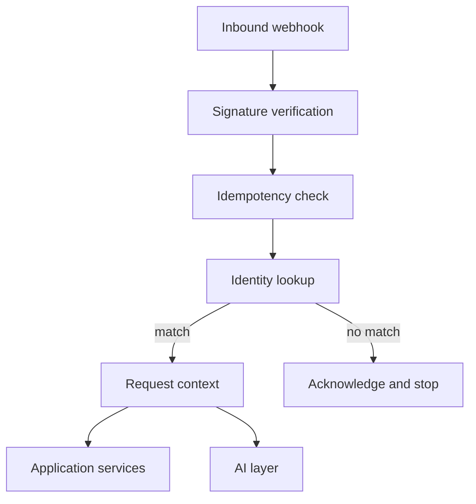

# ADR-007: Deterministic WhatsApp identity resolution

- Status: Accepted
- Date: 2026-10-05

## Context

Several people write to the same assistant number. The system has to know who sent each message in order to attribute transactions and to resolve words such as "I" and "we".

The sender could in principle be inferred from the conversation: a name, a writing style, a remark such as "it's me". Any such inference can be wrong and can be manipulated by the content of a message. In a system that records money, a misattributed transaction is corrupted data.

## Decision

Identity is resolved by lookup, before any AI processing, from the sender identifier the WhatsApp provider attaches to the webhook.

A `whatsapp_identities` table maps an external identity to a member:

| Column             | Purpose                                          |
| ------------------ | ------------------------------------------------ |
| `id`               | UUID primary key                                 |
| `member_id`        | The member this identity belongs to              |
| `provider`         | The WhatsApp provider that issued the identifier |
| `external_user_id` | The provider's stable identifier for the sender  |
| `phone_number`     | The sender's number in E.164 form                |
| `created_at`       | Creation timestamp                               |

`(provider, external_user_id)` is unique. The exact columns may be adjusted to the provider's API when the integration is built.



A successful lookup produces the request context that every downstream service receives:

```json
{
  "householdId": "…",
  "memberId": "…",
  "memberName": "…",
  "channel": "whatsapp"
}
```

Rules:

- The AI layer receives the member as a fact in its context. It is never asked who is speaking and its output can never change the sender.
- "I" resolves to the context member. "We" resolves to the household. A reference to another member by name is matched against the household's member list by the application. A name that matches no member, or more than one, leads to a question back to the sender.
- A message from an unknown identity is acknowledged to the provider and processed no further. No model is called, nothing is stored beyond the webhook event record, and no reply is sent.
- Identities are created by seeding from environment configuration. Phone numbers are personal data and are never committed to the repository or written to logs.

## Consequences

- Attribution cannot be altered by anything written in a message.
- Strangers who discover the number cannot consume model usage or learn that the number belongs to this system.
- Adding a person or a second phone is a data change.
- A member writing from an unregistered number is ignored until the number is registered. Self-service linking is out of scope for the first version.
- If the provider changes how it identifies senders, the mapping needs a migration. Keeping both the provider identifier and the phone number makes that recoverable.
