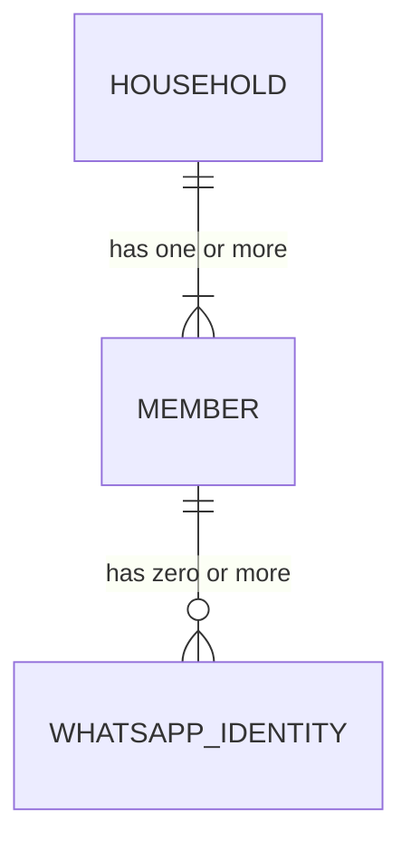

# ADR-011: Any number of households, any number of members

- Status: Accepted
- Date: 2026-10-05

## Context

The first real use of the system is a couple, and earlier records use that case to explain the household model. Examples with two people can harden into an assumption without anyone deciding it: a pair of columns, a two-way split in a calculation, a dashboard laid out for two names, a seed script with two fixed slots.

[ADR-006](ADR-006-household-and-members.md) states that the number of members is not fixed and [ADR-008](ADR-008-household-authorization-boundary.md) scopes every query by household. This record makes the cardinalities explicit and turns them into rules that the schema, the domain, the interface and the seed data must all satisfy.

## Decision

The system is a multi-household, multi-member personal finance platform. A couple is one configuration of it.

**Cardinality**

- A household has one or more members, held as rows in a `members` table that reference the household. One member, two members and many members are the same case to every part of the system.
- The application holds any number of independent households. Each owns its data directly through `household_id`, or indirectly through a row that carries it.
- A member has zero or more WhatsApp identities. A household therefore has as many identities as its members have registered, with no expected count.
- An identity belongs to exactly one member, and a member to exactly one household. Resolution always follows the same chain:

**What is ruled out**

- Positional columns or fields for members anywhere, such as `member_1_id` and `member_2_id` on a household, or per-member amount columns on a transaction, budget, goal or report.
- Any constraint, check or validation on the number of members in a household beyond requiring at least one.
- Calculations that assume a count, such as deriving one member's share as the remainder of another's. Shares and breakdowns are computed per member over whatever set of members exists.
- Interface layouts built for a fixed number of people. Per-member figures are rendered from a list.
- Seed logic with fixed slots. Seeding reads a list of members from configuration, and the couple is one such list.
- Member names or identifiers in code, prompts or tests of domain logic.

**How existing decisions apply to N members**

- `transactions.member_id` is the single member who performed the transaction, normally the sender resolved from the WhatsApp identity. Per [ADR-009](ADR-009-transaction-attribution.md) it can be another member of the same household only when a message names one explicitly. One column serves any household size.
- `accounts.owner_member_id` references any member of the household, or is null for an account held jointly. A household can have any number of individually owned and joint accounts.
- Budgets and goals aggregate over every transaction of the household. Per-member breakdowns group by `member_id`, and the planned `transaction_allocations` and `goal_contributions` tables are keyed by member, so they extend to any number of members unchanged.
- Authorization depends only on household membership. It does not depend on how many members a household has, and it does not separate members of the same household from each other.
- In conversation, "I" is the sender and "we" is the whole household. In a household of one they coincide.

**Isolation between households**

Isolation is enforced in the application and domain layers as set out in [ADR-008](ADR-008-household-authorization-boundary.md): the household comes only from the resolved request context, and every repository method requires it. Composite foreign keys on `(household_id, member_id)` additionally prevent a row in one household from referencing a member of another. Tests for each repository include a second household whose data must never appear in results.

## Consequences

- Adding a member is an insert into `members`, plus an identity row if they use WhatsApp. No schema, code or layout changes.
- Adding a household is likewise a data change, and its data is isolated from the first query onward.
- Finance engine tests must cover households of one, two and three or more members, so that an accidental two-member assumption fails a test.
- Self-service creation of households, invitations, billing and the other parts of running a hosted service remain out of scope. Households and members are created by seeding or by an operator. The model supports many households, while the product does not yet offer a way to sign up for one.
- A person still belongs to exactly one household. Membership in several would require a join table, as noted in ADR-006.
