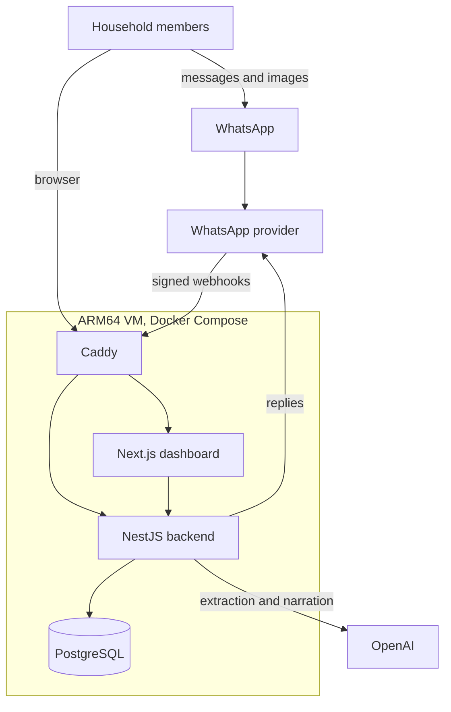
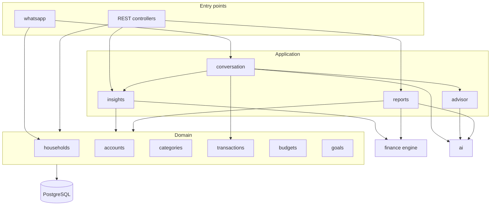
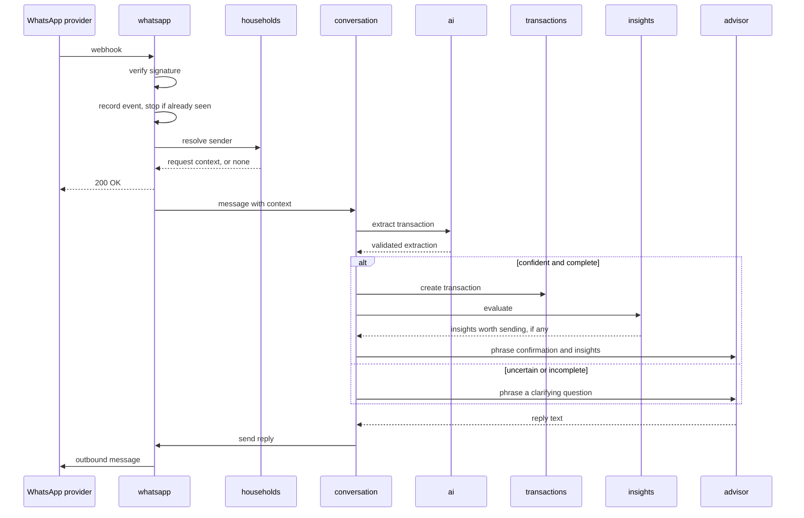
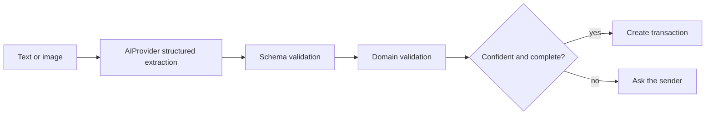
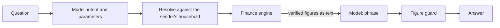
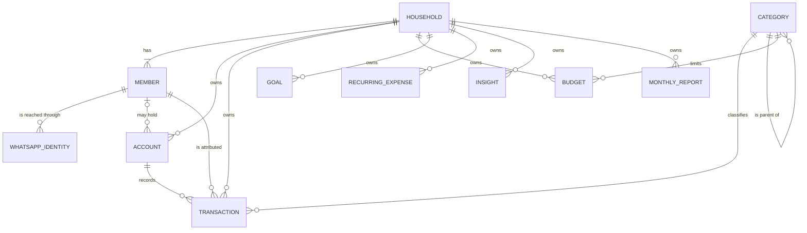
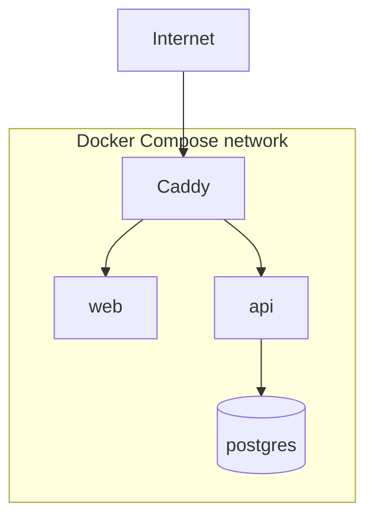

# Architecture

This document describes how the system is structured and why the pieces are arranged the way they are. Individual decisions are recorded in the [ADRs](adr/README.md) and referenced here. It describes the intended design. The [roadmap](../README.md#roadmap) shows what has been built.

## System context

The system is a multi-household, multi-member personal finance platform. The members of a household write to one assistant number on WhatsApp and look at one shared dashboard in a browser. A household has one or more members, and the application can hold any number of households, each isolated from the others ([ADR-011](adr/ADR-011-multi-household-multi-member.md)). Everything runs on a single ARM64 virtual machine.



| Component         | Responsibility                                                                         |
| ----------------- | -------------------------------------------------------------------------------------- |
| Caddy             | TLS termination and routing. The only container with a published port.                 |
| Next.js dashboard | Presentation of household data. Holds no business logic and no financial calculations. |
| NestJS backend    | All domain logic, persistence, AI orchestration and the WhatsApp webhook.              |
| PostgreSQL        | The persisted financial record. Reachable only from the backend container.             |
| WhatsApp provider | Delivery of inbound messages and outbound replies.                                     |
| OpenAI            | Language and vision models, reached through one adapter.                               |

## Guiding constraints

Four constraints shape almost every other choice.

1. **Financial figures are computed, never generated.** Balances, budget usage, trends, forecasts and goal progress come from deterministic code over integer minor units. A model never produces a number that is presented as fact.
2. **Model output is untrusted input.** Whatever a model returns is parsed, validated against the domain, and only then allowed to cause a write. See [ADR-004](adr/ADR-004-ai-output-validation.md).
3. **The household is the unit of ownership and of security.** Every financial row belongs to a household. Members exist for attribution, and nothing depends on how many there are. See [ADR-006](adr/ADR-006-household-and-members.md), [ADR-008](adr/ADR-008-household-authorization-boundary.md) and [ADR-011](adr/ADR-011-multi-household-multi-member.md).
4. **One deployable on one machine.** There are no queues, caches or separate services until a concrete need appears. See [ADR-001](adr/ADR-001-modular-monolith.md).

## Backend modules

The backend is a modular monolith. Each module owns its tables and exposes a small service interface to the others.



| Module         | Owns                                                                                               |
| -------------- | -------------------------------------------------------------------------------------------------- |
| `households`   | Households, members, WhatsApp identities and resolution of the request context                     |
| `accounts`     | Accounts and balances                                                                              |
| `categories`   | The category tree and mapping of names to categories                                               |
| `transactions` | Transaction validation, creation and querying, including transfers                                 |
| `budgets`      | Budget definitions                                                                                 |
| `goals`        | Goal definitions and progress inputs                                                               |
| `finance`      | The finance engine: pure calculations, and the service that feeds them                             |
| `ai`           | The `AIProvider` interface, its OpenAI implementation, interpretation and reply composition        |
| `whatsapp`     | Webhook handling, signature verification, idempotency and the provider adapter                     |
| `conversation` | Orchestration of a message: transaction extraction, financial questions and the reply              |
| `media`        | Obtaining an image through a provider-independent source, validating it and holding it temporarily |
| `insights`     | Rules that decide whether something deserves the household's attention                             |
| `advisor`      | Financial advice built on insights. Planned                                                        |
| `reports`      | Monthly report generation                                                                          |

### Dependency rules

- The finance engine imports nothing from NestJS, Drizzle, the AI module or the network. Its inputs and outputs are plain values. This is what makes it exhaustively testable and what guarantees a model cannot influence a calculation.
- Domain modules do not depend on `ai`, `whatsapp`, `advisor` or `conversation`. A transaction is created the same way whether it came from a message, an image or the dashboard.
- The OpenAI SDK is imported only inside the `ai` module's provider implementation. See [ADR-005](adr/ADR-005-openai-behind-provider-abstraction.md).
- Provider-specific WhatsApp code lives behind a `WhatsAppProvider` interface inside the `whatsapp` module. Nothing else knows which provider is in use.
- A module reads another module's data through that module's service, never through its tables.

## Request context

Every request, from either entry point, is resolved to a context before application code runs:

```json
{
  "householdId": "…",
  "memberId": "…",
  "memberName": "…",
  "channel": "whatsapp"
}
```

For WhatsApp the context comes from a lookup that follows identity to member to household ([ADR-007](adr/ADR-007-whatsapp-identity-resolution.md)). For the dashboard it comes from the authenticated session. Services receive the context explicitly, and repositories require its `householdId` on every query.

## Inbound message flow



Points that matter:

- **Idempotency comes first.** The provider's event identifier is stored in `webhook_events` under a unique constraint before any processing. A redelivered event is acknowledged and ignored.
- **Unknown senders stop at identity resolution.** No model is called and no reply is sent.
- **The webhook is acknowledged before slow work.** Model calls take seconds, and providers retry on slow responses. Processing continues in-process after the acknowledgement. A crash between acknowledgement and completion leaves an event marked as received but not processed, which is detectable and can be retried. A queue is deliberately not introduced for this.
- **Images follow the same path.** The image is downloaded to a temporary directory, validated, read by the model and deleted in a `finally` step whether reading succeeds or fails. Nothing but the structured result is persisted. See [vision-extraction.md](vision-extraction.md).

## Extraction and validation



The model proposes a transaction: type, amount, currency, merchant, description, category, date, payment method and a confidence. The application then checks, in order:

1. The response matches the schema.
2. The amount is a positive exact decimal that converts to minor units without loss, and the currency is a known code.
3. The category is one that exists. The model cannot create categories.
4. The date is plausible.
5. The confidence meets the configured threshold and no required field is missing.

Any failure leads to a question for the sender, never to a guessed value. The member and household are not part of the extraction at all. They come from the request context.

## Questions and advice

A question is interpreted into one structured intent with parameters. The application resolves the parameters, runs the finance engine method that intent maps to, and gives the model the verified result to phrase ([ADR-016](adr/ADR-016-task-level-ai-capabilities.md)).



- The household always comes from the request context. The model can name a category, a period, an account or a member to filter by. It cannot name a household.
- The intent and its parameters are validated like any other model output.
- The model receives figures as finished text. A reply containing a number that was not supplied is replaced by a deterministic one.
- "I" maps to the context member and "we" to the household. The mapping is done by the application.

The details are in [ai-integration.md](ai-integration.md).

## Insights

After a transaction is recorded, the finance engine recomputes the affected figures and the insight engine applies rules to them. Each rule yields nothing or an insight with a severity from `INFO` to `CRITICAL`.

The insight engine is separate from the advisor on purpose. Deciding whether something is worth saying is a deterministic rule that can be tested. Deciding how to say it is a language task. Only insights above a severity threshold are appended to a reply, and an insight that was already delivered for the same budget and period is not repeated. This is what keeps the assistant from commenting on every purchase.

## Data model



Conventions that hold across the schema:

- Members are rows related to a household, one to many. No table has positional or per-member columns, and no constraint limits how many members a household has.
- An account's `owner_member_id` references any member of the household, or is null for a joint account.
- UUID primary keys, `created_at` everywhere and `updated_at` on mutable rows.
- Money is stored as an integer amount in minor units next to an ISO 4217 currency code. Amounts in different currencies are never summed or converted, and a transaction is always in the currency of its account ([ADR-012](adr/ADR-012-money-as-integer-minor-units.md)).
- A transfer is one row with a source and a destination account of the household ([ADR-013](adr/ADR-013-transfers-as-single-transaction.md)). It is excluded from income and expense figures by its type, so moving money between accounts never changes spending or net worth.
- Constraints carry the invariants the application relies on: positive amounts, valid enumerations, members belonging to the household they are used in, and unique provider event identifiers.

Supporting tables for conversations, messages and webhook events sit outside the financial model. The schema is documented in [database.md](database.md). The reasoning for the household model is in ADRs [006](adr/ADR-006-household-and-members.md), [009](adr/ADR-009-transaction-attribution.md), [010](adr/ADR-010-household-budgets-and-goals.md) and [011](adr/ADR-011-multi-household-multi-member.md).

## Finance engine

The engine is a set of pure functions over the ledger entries of one household, with a service that loads the data and calls them ([ADR-015](adr/ADR-015-pure-finance-engine.md)). It calculates spending and income breakdowns, cash flow, savings, budget usage, goal progress, trends, forecasts, recurring expenses, anomalies, account balances and insights.

The same calculation serves household and per-member analytics: results carry a breakdown by member for however many members the household has. Calculations work in one currency at a time and fail if given another. Ratios are integer basis points.

Calculations, methodologies and thresholds are described in [finance-engine.md](finance-engine.md).

## Deployment



- Four containers: `caddy`, `web`, `api` and `postgres`. All images are built for ARM64.
- Only Caddy publishes ports. PostgreSQL is reachable only on the internal network and stores its data on a named volume.
- The virtual machine, network and firewall rules are provisioned with Terraform.
- Configuration and secrets are supplied through environment variables. The repository contains only an example file with placeholders.

## Security

| Concern                | Approach                                                                                                                                  |
| ---------------------- | ----------------------------------------------------------------------------------------------------------------------------------------- |
| Transport              | HTTPS terminated at Caddy with automatically managed certificates                                                                         |
| Webhook authenticity   | Signature verification on the raw request body before parsing                                                                             |
| Replay and duplication | Unique provider event identifiers in `webhook_events`                                                                                     |
| Sender identity        | Deterministic lookup, with unknown senders dropped                                                                                        |
| Dashboard access       | Authenticated session that carries the member and household                                                                               |
| Authorization          | Household scope from the request context on every query                                                                                   |
| Input                  | Schema validation on every request body and on every model output                                                                         |
| Prompt injection       | Message content can only ever propose a transaction or a query intent. Both are validated and both are confined to the sender's household |
| Logging                | Structured logs without message bodies, amounts, merchants or phone numbers                                                               |
| Data minimisation      | Images are deleted after extraction and never stored                                                                                      |

## What is deliberately absent

No message queue, cache, object storage, background worker process, service mesh or second database. Each would be justified by a specific problem that has not yet appeared. When one does, the module boundaries above are where a split would be made.
