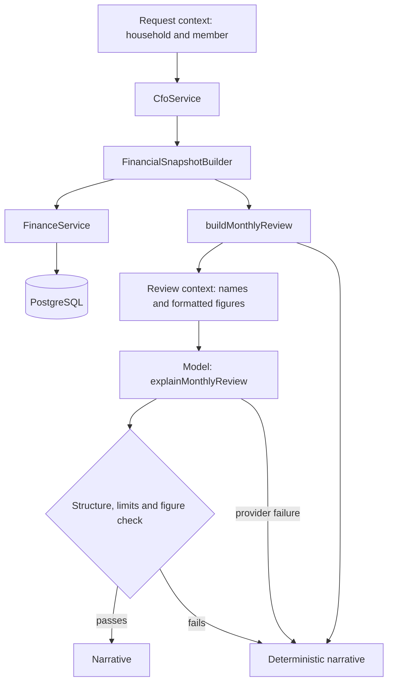

# CFO intelligence

This layer turns the figures the finance engine calculates into a monthly review a household can read and act on: how the month is going, what changed, what deserves attention and what to do next.

It has two halves with a hard line between them. The first is deterministic and produces every fact. The second is a language model that puts those facts into words. Nothing crosses the line in the other direction: the model cannot add a figure, read data or change anything.



## Structure

```
apps/api/src/cfo
├── analysis
│   ├── financial-snapshot.ts           what the engine knows about one month in one currency
│   ├── financial-snapshot.builder.ts   gathers it from FinanceService
│   └── monthly-review.ts               the deterministic review and its findings
├── context
│   ├── review-context.ts               the review as the model sees it
│   └── result-description.ts           identifiers to names, amounts and ratios to text
├── explanation
│   ├── review-explainer.ts             ask the model, validate, fall back
│   ├── deterministic-narrative.ts      the narrative with no model
│   └── narrative-format.ts             one chat message from a narrative
└── cfo.service.ts                      the entry point
```

`CfoService.monthlyReview(context, { month, today, userMessage })` is the only public operation. It has no HTTP endpoint. The assistant calls it when a message is interpreted as a request for a review, and the WhatsApp layer is unchanged: it still hands a message to the assistant and sends back the reply.

## Deterministic engine and AI layer

| Produced deterministically                         | Left to the model         |
| -------------------------------------------------- | ------------------------- |
| Income, spending, net cash flow, savings rate      | Wording                   |
| Comparison with the previous period                | Which facts to lead with  |
| Budget usage and status, projections               | Tone                      |
| Goal progress and state                            | Phrasing a recommendation |
| Recurring commitments and their monthly equivalent | Language of the reply     |
| Unusual spending                                   |                           |
| Findings: what counts as a strength or a concern   |                           |
| Which month, which currencies, which household     |                           |

The review is complete and usable before any model is involved. The model's contribution can be removed and the household still receives a correct review.

## Financial snapshot

A snapshot is everything the finance engine knows about one household, one month and one currency. `FinancialSnapshotBuilder` assembles it by calling the existing `FinanceService` methods. It performs no calculation of its own and reads no table.

| Part                           | From                             |
| ------------------------------ | -------------------------------- |
| Cash flow and savings          | `cashFlow`                       |
| Spending and income breakdowns | `spending`, `income`             |
| The previous equivalent period | `cashFlow`, `spending`, `income` |
| Trends by category and member  | `spendingTrends`                 |
| Budgets                        | `budgets`                        |
| Goals                          | `goals`                          |
| Forecast                       | `monthEndForecast`               |
| Recurring expenses             | `recurringExpenses`              |
| Anomalies                      | `anomalies`                      |
| Insights                       | `insights`                       |
| Balances                       | `accountBalances`                |

For the current month the snapshot covers the month to date, with today taken from the household's time zone. For a past month it covers the whole month, has no forecast, and has no balances, since balances are only known as they stand now.

## Monthly review

`buildMonthlyReview` is a pure function from a snapshot to a review. It selects, arranges and classifies. The only numbers it derives are comparisons between two amounts the engine already produced and the monthly equivalent of recurring commitments, both through finance engine functions.

A review contains the totals, the comparison, the largest top-level categories, spending and income per member, the categories that rose and fell most, each budget with its projection, goals, the forecast, recurring commitments, anomalies, balances and findings.

It can be produced for the current month, the previous month, or any earlier month. A month that has not started is refused.

### Comparisons

A review compares with the previous equivalent period: a completed month with the month before, and a month in progress with the same days of the month before.

When the previous period has no transactions at all, there is no comparison. The review says so and reports no changes, increases or decreases. A household in its first month is not told its spending rose from nothing.

### Findings

A finding is a coded, deterministic judgement with the figures behind it.

| Strength               | Raised when                                                          |
| ---------------------- | -------------------------------------------------------------------- |
| `POSITIVE_CASH_FLOW`   | Income exceeds spending                                              |
| `HEALTHY_SAVINGS_RATE` | Savings rate is at least 20%                                         |
| `SPENDING_DECREASED`   | Total spending is down at least 25% and by a material amount         |
| `BUDGETS_ON_TRACK`     | There are budgets and none is near, over or projected over its limit |
| `GOAL_COMPLETED`       | A goal has reached its target                                        |

| Concern                       | Raised when                                                  |
| ----------------------------- | ------------------------------------------------------------ |
| `NEGATIVE_CASH_FLOW`          | Spending exceeds income                                      |
| `LOW_SAVINGS_RATE`            | Savings rate is below 5% and not negative                    |
| `SPENDING_INCREASED`          | Total spending is up at least 25% and by a material amount   |
| `CATEGORY_SPENDING_INCREASED` | The engine raised a spending-increase insight for a category |
| `BUDGET_EXCEEDED`             | A budget is over its limit                                   |
| `BUDGET_NEAR_LIMIT`           | A budget has reached its alert threshold                     |
| `BUDGET_PROJECTED_OVER_LIMIT` | A budget is within its limit but projected to end over it    |
| `UNUSUAL_SPENDING`            | The engine detected an anomaly                               |
| `GOAL_OVERDUE`                | A goal is past its date and incomplete                       |
| `PROJECTED_SHORTFALL`         | Projected spending exceeds expected income                   |

Findings that correspond to an engine insight are taken from that insight and not recalculated. The thresholds that are new to the review, the two savings-rate levels and the number of categories listed, are in the `review` section of `FinancePolicy`, next to every other threshold ([finance-engine.md](finance-engine.md)). Threshold checks compare exact amounts, not rounded percentages.

## What the model receives

`toReviewContext` converts a review into the context sent to the model:

- Identifiers are replaced by names. No household, member, account, category, budget, goal or transaction identifier is included.
- Amounts are text such as `€2,089.99` and ratios are text such as `30.33%`, formatted by the application with exact arithmetic.
- It contains the review and nothing else: no transaction list, no account names or numbers, no phone numbers, no conversation history.
- Member names appear only in the spending breakdown, and only when the household has more than one member.
- A typical context is a few kilobytes.

Along with the context, the model receives the sender's first name and the message they wrote, so it can reply in their language.

## What the model returns

`AIProvider.explainMonthlyReview` returns structured output:

| Field             | Content                                       |
| ----------------- | --------------------------------------------- |
| `summary`         | A few sentences on how the household is doing |
| `strengths`       | What is going well                            |
| `concerns`        | What deserves attention                       |
| `recommendations` | Practical suggestions tied to the concerns    |
| `priorities`      | The most important next steps, in order       |

The model's output is text only. It has no way to express an action, and nothing it returns is written to the database.

## Numeric truth

`ReviewExplainer` validates the output before anyone sees it.

1. **Structure.** It must match the schema exactly.
2. **Limits.** A non-empty summary of bounded length, at most five points per section, each of bounded length.
3. **Figures.** Every number anywhere in the narrative must appear in the review context or in the member's own message. Numbers are compared by value, so `€2,089.99`, `2.089,99 €` and `2089.99` are the same figure.

A narrative that fails any check is discarded whole. There is no attempt to repair it and no second request: the deterministic narrative is used instead.

The figure check means the model cannot state a total it added up, a difference it worked out, a percentage it estimated, a target it thinks is sensible, or a count. A recommendation such as "limit restaurants to €150" is rejected unless €150 is a figure in the review. The model can still say a number that is in the review in the wrong place, for example attributing one category's total to another. The check guarantees that no number is invented. It does not prove that every sentence is right.

## Fallback

`renderDeterministicNarrative` builds the same five sections from the findings with fixed sentence templates. It is used when:

- the provider times out, is rate limited, is unavailable or rejects the request
- the output is malformed
- the output exceeds the limits
- the output contains a number that is not in the review

The fallback narrative is in English and plainer than the model's. Its figures are the same, because both come from the same review.

With no AI provider configured at all, every review is produced this way.

## Household isolation

`CfoService` takes the request context that identity resolution produced. The household identifier is read from that context and passed to every finance engine call. No parameter of a review request can name a household, and the model is never asked which household or member a review is for.

Names in the context come from the same household's members, categories, accounts and goals. A review for one household contains nothing calculated from, or named after, another.

All members of a household see the same review. There is no private view.

## Households of any size

The review lists spending and income for every member of the household, whether there is one or many. Nothing is computed as a share between two people. For a household of one the member breakdown is left out of the model's context, since it would only repeat the totals.

## Currencies

A review is in one currency. A household with accounts in several currencies receives one review per currency, each calculated from that currency's transactions alone. There is no combined total anywhere, in the review, the context or the fallback narrative, and the model is instructed to keep them apart.

The household's own currency is always reviewed. Another currency is included only when it has transactions in the month, or budgets or goals.

## Through WhatsApp

`MONTHLY_REVIEW` is one of the intents the interpreter can return ([ai-integration.md](ai-integration.md)). Messages such as "how are we doing this month?", "what changed compared with last month?", "where are we spending too much?" and "what should we improve?" map to it. The period in the message selects the month, and the default is the current one.

The reply is the narrative as one message: the summary, then strengths, concerns and recommendations each marked with a symbol, then numbered priorities. The symbols avoid section headings in a language that might not match the reply.

## Limitations

- A review covers a calendar month. Weeks and custom ranges are answered by the existing question intents.
- "Can I afford €200 this weekend?" has no dedicated calculation yet. It is interpreted as a forecast question.
- Reviews are generated on request. They are not scheduled, sent proactively or stored in `monthly_reports`.
- Insights are computed for each review and not persisted, so nothing yet prevents the same concern from being mentioned in consecutive reviews.
- The fallback narrative is in English.
- The figure check occasionally rejects a harmless narrative, for example one that counts items.
- Account balances are available only for the current month.
- The model's use of a real figure in the wrong context is not detected.
- Not exercised against the live OpenAI API in this repository.
