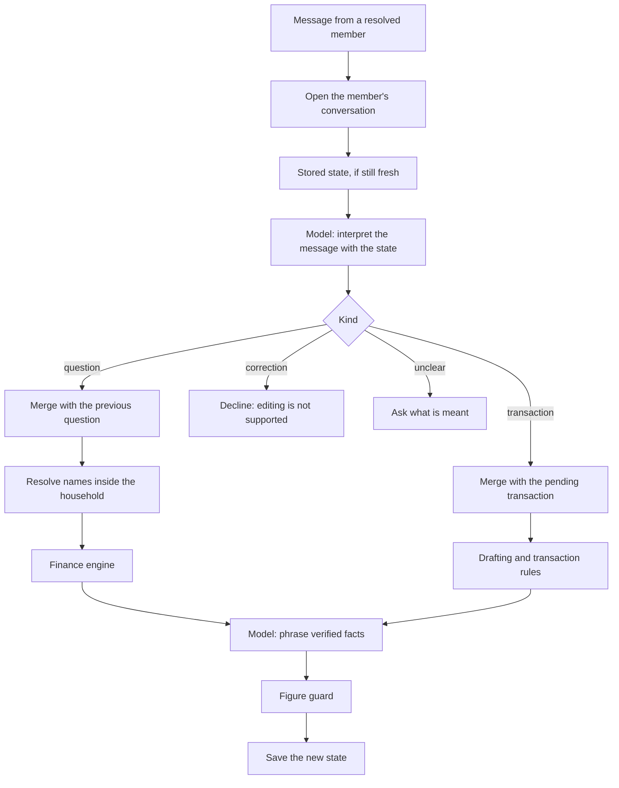

# Conversation

A member can hold a conversation with the assistant: ask a question, follow it with "and last month?", ask "why?", narrow it to one category, then record an expense. Each message is still handled as one request that maps to one application operation. What makes it a conversation is a small amount of state the application keeps between messages.

The assistant is not an agent. It does not plan, loop or call tools. A model reads one message and returns one structured interpretation. The application decides what that means, runs one operation, and has the model phrase the verified result.



## Structure

```
apps/api/src/conversation
├── financial-assistant.service.ts   one message in, one reply out
├── conversation-policy.ts           the bounds on what a conversation holds
├── conversation-state.ts            the shape of the stored state and its expiry
├── conversations.repository.ts      persistence of messages and state
├── follow-up/question-resolution.ts merging a follow-up with the previous question
├── extraction/pending-transaction.ts completing a pending transaction
├── extraction/                      drafting and recording transactions
├── queries/                         answering questions through the finance engine
└── image/                           image transactions
```

The conversation layer reaches data only through application services: the finance service, the transactions service, the CFO service and a household directory that supplies names. Its one repository is its own. An architecture test enforces this.

## What a conversation remembers

A conversation belongs to one member of one household on one channel. There is exactly one per member and channel, enforced by a unique key. It stores:

| Item                  | Content                                                                   |
| --------------------- | ------------------------------------------------------------------------- |
| Messages              | The text of the last 20 messages from both sides                          |
| The previous question | Intent, period reference, category name, account name, member scope       |
| A pending transaction | The candidate that could not be recorded yet, why, and where it came from |
| The last outcome      | What the previous message led to                                          |

The state holds no amount that was calculated, no total, no percentage and no identifier. A stored question is the same kind of object the model produces when it interprets a message: names and a period reference such as `PREVIOUS_MONTH`.

### Bounds

| Limit                                     | Value                                |
| ----------------------------------------- | ------------------------------------ |
| Messages kept per conversation            | 20                                   |
| Length of a stored or interpreted message | 1 000 characters                     |
| Earlier messages shown to the model       | The sender's last 3                  |
| Lifetime of the stored state              | 30 minutes since it was last written |

These are in `conversation-policy.ts`. Because every part of the context is bounded, the size of a request to the model does not grow with the length of a conversation.

After 30 minutes without activity the previous question and any pending transaction are forgotten. A follow-up that arrives later is treated as having nothing to follow.

## Trusted and untrusted context

| Context                               | Trust                                                                                                                          | Used for                                     |
| ------------------------------------- | ------------------------------------------------------------------------------------------------------------------------------ | -------------------------------------------- |
| Request context: household and member | Trusted. Produced by identity resolution                                                                                       | Every lookup and every calculation           |
| Stored state                          | Structural only. Written by the application, validated again on every read, and its names resolved again against the household | Telling the model what a follow-up refers to |
| The sender's earlier messages         | Untrusted text                                                                                                                 | Helping the model with wording               |
| Earlier assistant replies             | Never used                                                                                                                     | Nothing                                      |
| The model's interpretation            | Untrusted                                                                                                                      | Proposing one operation and its parameters   |

**The model never sees its own earlier replies.** The interpretation request contains the stored state and the sender's recent messages. Replies are stored for the record and never sent back. A figure in an earlier reply therefore cannot be picked up and repeated, whether that figure was right, wrong or injected.

**State is not a cache of answers.** When a follow-up refers to the previous question, the application runs the finance engine again. Nothing calculated for one message is reused for the next.

**State is validated on every read.** It is parsed against its schema. State that does not match, including state altered in the database, is discarded, and any property the schema does not define is dropped.

**Names are resolved every time.** A category, account or member name in the stored question is looked up again among the sender's household's categories, accounts and members. A name that belongs to another household matches nothing.

## Follow-up resolution

When a message is a follow-up, the model does not rebuild the whole question. It fills in what the message states and lists which parts of the previous question to keep:

```json
{
  "intent": "SPENDING_TOTAL",
  "period": { "kind": "PREVIOUS_MONTH" },
  "category": null,
  "inheritFromPrevious": ["INTENT", "CATEGORY", "ACCOUNT", "MEMBER"]
}
```

`resolveFollowUp` then merges the two deterministically.

| Slot listed | Effect                                                        |
| ----------- | ------------------------------------------------------------- |
| `INTENT`    | The previous intent replaces the one given                    |
| `PERIOD`    | The previous period is used if the message states none        |
| `CATEGORY`  | The previous category is used if the message states none      |
| `ACCOUNT`   | The previous account is used if the message states none       |
| `MEMBER`    | The previous member scope is used if the message names nobody |

A slot that is not listed is not carried over. What a message states always wins over what it inherits. The model is instructed never to copy a value from the previous question into a field, so carrying over is done by the application or not at all.

| Message                         | Stated                   | Inherited                         | Result                                |
| ------------------------------- | ------------------------ | --------------------------------- | ------------------------------------- |
| "And last month?"               | Period                   | Intent, category, account, member | Same question, previous month         |
| "Only restaurants"              | Category                 | Intent, period                    | Same question, one category           |
| "What about the joint account?" | Account                  | Intent, period, category          | Same question, one account            |
| "What about Member B?"          | Member                   | Intent, period, category          | Same question, one member             |
| "And compared with last month?" | Intent: trend            | Category                          | Trend for the same subject            |
| "Why?"                          | Intent: change           | Category                          | Breakdown of the change               |
| "Show me the biggest one"       | Intent: largest expenses | Period, category                  | Largest expenses for the same subject |

The merged question is then resolved exactly as a fresh question is: the period against the household's current date, names against the household. "I" in a follow-up is the member who is writing now, because a conversation belongs to one member.

### One operation per message

Each intent maps to one finance engine method. Two intents need more than one calculation, and each is an explicit composition written in the application, not something the model orchestrates:

| Intent            | Composition                                                                                  |
| ----------------- | -------------------------------------------------------------------------------------------- |
| `SPENDING_CHANGE` | The trend for the subject, the trends of its subcategories, and any anomalies detected in it |
| `MONTHLY_REVIEW`  | The monthly review ([cfo-intelligence.md](cfo-intelligence.md))                              |

`LARGEST_EXPENSES` is a single engine method that lists the largest expenses matching the question's filters.

## Clarification

The assistant asks instead of guessing in four situations.

| Situation                                                          | Reason given to the reply                               |
| ------------------------------------------------------------------ | ------------------------------------------------------- |
| The model cannot tell what a message refers to                     | `AMBIGUOUS_REFERENCE`                                   |
| A follow-up arrives with no previous question, or after it expired | `NO_PREVIOUS_QUESTION`                                  |
| A name matches nothing in the household                            | `UNKNOWN_CATEGORY`, `UNKNOWN_MEMBER`, `UNKNOWN_ACCOUNT` |
| A name matches more than one account                               | `AMBIGUOUS_ACCOUNT`                                     |

When a question fails on one part, the parts that were understood are kept as the previous question. "How much on gadgets last month?" followed by "I meant restaurants" answers for restaurants last month.

Where a reference can be resolved deterministically it is. An account name that matches several accounts resolves to the sender's own if exactly one of them is theirs ([ADR-017](adr/ADR-017-account-resolution.md)).

## Transactions in a conversation

### Completing a pending transaction

When a transaction cannot be recorded because something is missing, the candidate is stored as pending together with the reasons. The next message is interpreted with that pending transaction in view. If it supplies what was missing, the model returns only the newly stated fields and marks the message as completing the pending transaction. The application merges the two and runs the full validation again.

```
"Gastei 30"      → pending: amount 30, category missing
"Restaurantes"   → states category only → merged → recorded: €30.00, Restaurants
```

If the model does not recognise a short answer, such as just "inter" after being asked which account, and returns it as unrelated, the application still tries it against the pending transaction: when the pending reasons ask for an account or a category and the message names exactly one that fits, ignoring case, accents and punctuation, it completes the transaction the same way. Otherwise the message is handled as unrelated and the transaction stays pending.

The question asked for a pending transaction is written from facts in plain words in the household's language: what was understood and what is still needed. Reason codes and field values such as `INCOME` are not part of them.

The amount comes from the stored candidate, which came from the member's own message or image. It does not come from the assistant's clarifying question, which the model is never shown. This applies to images too: a receipt whose category was unclear is completed from the stored reading and recorded as an image transaction with the image's message identifier.

A completing message with nothing pending is treated as a new, incomplete transaction and leads to a question.

### Corrections are not applied

"Actually it was €28", "I meant yesterday" and "delete that" after a recorded transaction are interpreted as corrections. The assistant replies that changing or deleting a recorded transaction is not supported yet, and changes nothing.

Editing is deliberately out of scope. Applying a correction means choosing which transaction is meant and changing a financial record on the strength of a model's reading of a short message, and that needs its own design with confirmation.

The model is told what happened last, for example that a transaction was just recorded, so that a correction is recognisable. Recognising one is still the model's judgement: a correction that it reads as a new expense would be recorded as a second transaction. The reply always states what was recorded, so the member can see it.

## Images

An image is handled by the image flow ([vision-extraction.md](vision-extraction.md)) and receives no conversation context. The image request contains the image, its caption and the names of accounts and categories, as before. An image neither reads nor disturbs the previous question, so a follow-up after an image still works.

## Replies and fallback

Replies are composed as before ([ai-integration.md](ai-integration.md)): the model phrases facts the application supplies as finished text, and a reply containing any number that is not among those facts is replaced by a plain rendering of the facts.

| Failure                                                 | Result                                                                                                                           |
| ------------------------------------------------------- | -------------------------------------------------------------------------------------------------------------------------------- |
| Interpretation fails or returns invalid output          | A fixed message asking the member to try again. The stored state is left as it was, so a retry of the same follow-up still works |
| Reply composition fails or states an unsupported figure | A plain deterministic reply built from the engine's result                                                                       |

## Household isolation

- A conversation is keyed by household, member and channel. A member's state is never visible to another member or household, including a follow-up sent by a different member of the same household.
- The household for every operation comes from the request context, never from the state or the model.
- Stored names are resolved inside the sender's household on every use.
- Identifiers a model adds to its interpretation are dropped by schema validation and never reach the state.
- Nothing is cached between requests, so there is no result that could be served to the wrong household.

## Concurrency

Messages from one sender are processed one at a time in the order they arrived ([whatsapp-integration.md](whatsapp-integration.md)), so a follow-up is always interpreted after the message it follows. Different senders are processed in parallel and share no state. A redelivered webhook is stopped at the idempotency boundary and does not add to or advance a conversation.

## Limitations

- Recorded transactions cannot be edited or deleted through conversation.
- A correction misread by the model as a new expense would be recorded as one.
- A follow-up depends on the model listing the right slots to inherit. A wrong list produces an answer to a different question, with correct figures for that question. The reply states the category, period and member it answered for.
- Only the previous question is remembered, not a history of them. "The one before that" is not resolvable.
- Questions are answered in the household's currency. Accounts in other currencies appear in balances.
- "Why?" explains a change through subcategories and unusual spending. It does not attribute a change to individual merchants.
- State lives for 30 minutes. The value is a policy constant, not a per-household setting.
- Not exercised against the live OpenAI API in this repository.
