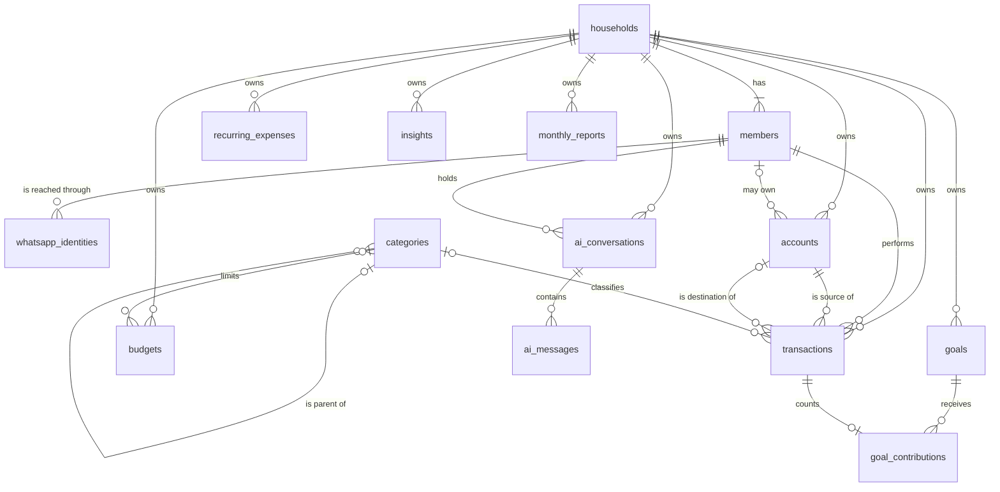

# Database

PostgreSQL is the only data store ([ADR-003](adr/ADR-003-postgresql.md)). The schema is defined in TypeScript with Drizzle, next to the module that owns each table, and reaches the database only through SQL migrations committed in `apps/api/drizzle`.

## Workflow

```
empty database → migrations → schema and default categories → seed → working database
```

| Command, from `apps/api` | Purpose                                                                         |
| ------------------------ | ------------------------------------------------------------------------------- |
| `npm run db:generate`    | Compare the Drizzle schema with the last snapshot and write a new SQL migration |
| `npm run db:migrate`     | Apply pending migrations to the database in `DATABASE_URL`                      |
| `npm run db:seed`        | Load a household definition. Safe to run repeatedly                             |

A schema change is made by editing a `*.schema.ts` file, running `db:generate`, reviewing the generated SQL and committing both. Tables are never created or altered by hand. Migrations are applied by the same code in development, in the integration tests and in deployment.

## Entities



| Table                     | Purpose                                                                                    | Household scope                                                         |
| ------------------------- | ------------------------------------------------------------------------------------------ | ----------------------------------------------------------------------- |
| `households`              | The unit that owns financial data, with its currency and time zone                         | Is the scope                                                            |
| `members`                 | People in a household, one to many                                                         | `household_id`                                                          |
| `whatsapp_identities`     | External sender identity mapped to one member                                              | Through `member_id`                                                     |
| `accounts`                | Where money is held. `owner_member_id` is null for a joint account                         | `household_id`                                                          |
| `member_default_accounts` | The account a member's transactions go to when none is named                               | `household_id`                                                          |
| `categories`              | The controlled category tree                                                               | Global reference data                                                   |
| `transactions`            | Expenses, income and transfers                                                             | `household_id`                                                          |
| `budgets`                 | A limit for a category, or for all spending when the category is null                      | `household_id`                                                          |
| `goals`                   | Savings targets                                                                            | `household_id`                                                          |
| `goal_contributions`      | Amounts counted toward a goal, optionally linked to the transaction they came from         | `household_id`, with composite keys to the goal, member and transaction |
| `recurring_expenses`      | Reserved for commitments confirmed by hand. Not written: detection is derived              | `household_id`                                                          |
| `insights`                | Findings worth the household's attention                                                   | `household_id`                                                          |
| `monthly_reports`         | One structured report per household, month and currency                                    | `household_id`                                                          |
| `ai_conversations`        | One conversation per member and channel, with its short-lived structured state             | `household_id`                                                          |
| `ai_messages`             | Text of a conversation's messages                                                          | Through `conversation_id`                                               |
| `webhook_events`          | Provider event identifiers already seen                                                    | None. Holds no financial or personal data                               |
| `member_access_codes`     | The hash of each member's dashboard access code                                            | `household_id`                                                          |
| `dashboard_sessions`      | Hashed session tokens with their expiry                                                    | `household_id`                                                          |
| `proactive_notifications` | One row per household and stable event key, with its status and read mark                  | `household_id`                                                          |
| `notification_deliveries` | One row per notification, member, channel and level, with attempts                         | `household_id`, composite key to `members`                              |
| `evaluation_leases`       | Which process is running a proactive evaluation, and until when                            | None. Holds no financial or personal data                               |
| `platform_admins`         | Members who may manage every household ([ADR-033](adr/ADR-033-platform-administration.md)) | Composite key to `members`                                              |
| `platform_actions`        | Who did what to which household or member, as identifiers only                             | None. Read by platform admins only                                      |

Every table has a UUID primary key and `created_at`. Mutable tables have `updated_at`.

## Household isolation in the schema

Application code scopes every query by household ([ADR-008](adr/ADR-008-household-authorization-boundary.md)). The schema backs this up so that a defect in application code cannot link rows across households.

- `members` has a unique key on `(household_id, id)`.
- Every table that references a member alongside a household does so with a composite foreign key on `(household_id, member_id)`. This applies to `accounts`, `transactions`, `recurring_expenses`, `insights` and `ai_conversations`.
- `transactions` references its accounts through `(household_id, account_id, currency)`, so an account of another household cannot be used.

Nothing in the schema refers to a position or a count of members. A household with one member and a household with twenty use the same rows and constraints ([ADR-011](adr/ADR-011-multi-household-multi-member.md)).

## Money

Amounts are `bigint` integers in minor units, in columns suffixed `_minor`, always beside a `currency` column holding an ISO 4217 code ([ADR-012](adr/ADR-012-money-as-integer-minor-units.md)).

A transaction's currency is part of its foreign key to the account, so a transaction is always in the currency of the account it moves money in. There is no conversion anywhere in the system.

## Transactions

| Column                     | Notes                                                                         |
| -------------------------- | ----------------------------------------------------------------------------- |
| `member_id`                | The member who performed the transaction. Mandatory                           |
| `account_id`               | The account the money left, or entered for income                             |
| `transfer_account_id`      | The destination account. Present only on a transfer                           |
| `type`                     | `EXPENSE`, `INCOME` or `TRANSFER`                                             |
| `amount_minor`, `currency` | Always positive. Direction comes from the type                                |
| `category_id`              | Optional. Never set on a transfer                                             |
| `expense_scope`            | `HOUSEHOLD` by default, or `INDIVIDUAL`. Analytics only, never access control |
| `transaction_date`         | The calendar date of the transaction                                          |
| `source`                   | `WHATSAPP_TEXT`, `WHATSAPP_IMAGE`, `WEB`, `MANUAL` or `IMPORT`                |
| `source_message_id`        | The provider's identifier for the originating message                         |
| `ai_confidence`            | Between 0 and 1 when the transaction came from extraction                     |

A transfer is a single row with a source and a destination ([ADR-013](adr/ADR-013-transfers-as-single-transaction.md)). Check constraints require a destination on transfers and only on transfers, require the two accounts to differ, and forbid a category.

The message text or image a transaction came from is not stored on it.

## Categories

Categories are global reference data created by a migration ([ADR-014](adr/ADR-014-global-category-list.md)). Each has a kind, `EXPENSE` or `INCOME`, and an optional parent. Names are unique among siblings.

## Idempotency

`webhook_events` has a unique key on `(provider, external_event_id)`. Recording an event is an insert that ignores conflicts. When no row comes back, the event was already seen and processing stops.

`proactive_notifications` has a unique key on `(household_id, event_key)` and `notification_deliveries` on `(notification_id, member_id, channel, level)`. An event is created, and a delivery claimed, by an insert that ignores or conditionally updates on conflict, so repeated or concurrent evaluations send one message. See [proactive-cfo.md](proactive-cfo.md).

## Planned extensions

These are not implemented. They are listed to show that the current tables do not need to change to accommodate them.

| Extension          | Shape                                                                                                                     |
| ------------------ | ------------------------------------------------------------------------------------------------------------------------- |
| Expense splitting  | `transaction_allocations (transaction_id, member_id, amount_minor)`, portions summing to the transaction amount           |
| Goal contributions | `goal_contributions (goal_id, member_id, amount_minor, contributed_on)`, with the goal's current amount derived from them |
| Custom categories  | A nullable `household_id` on `categories`                                                                                 |

## Seed data

`db:seed` loads a household from a definition: a household, a list of members, and optional accounts, budgets and goals. The committed definition is a demo household with three members, individual and joint accounts, and fictional phone numbers.

To seed a real household, write a definition as JSON and point `SEED_DEFINITION_FILE` at it:

```sh
SEED_DEFINITION_FILE=./seed.local.json npm run db:seed
```

Files matching `*.local.json` are ignored by Git. Real names and phone numbers belong there and nowhere in the repository.

Seeding derives identifiers from names, so running it again changes nothing.
