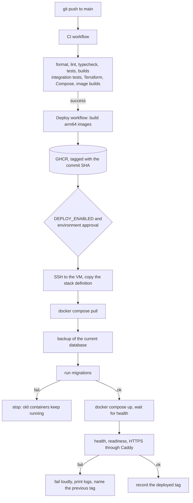

# Deployment

How a commit becomes the running production system, how to set that up the first time, and how to go back.

No deployment to the real Oracle VM has been performed from this repository. Everything below was exercised on a development machine with the same Compose stack, or is validated in CI, as noted in [What has and has not been verified](#what-has-and-has-not-been-verified).

## Flow



## Continuous integration

`.github/workflows/ci.yml` runs on every push to `main` and on every pull request.

| Job              | What it does                                                                            |
| ---------------- | --------------------------------------------------------------------------------------- |
| `quality`        | `npm ci`, formatting check, lint, typecheck, unit tests, both builds                    |
| `integration`    | Integration tests against a PostgreSQL 17 service container                             |
| `infrastructure` | `terraform fmt`, `validate` and `test`; Compose and Caddy configuration; `shellcheck`   |
| `images`         | Builds both production images on an ARM64 runner and checks they run as a non-root user |

CI uses no secret. The model and WhatsApp are fakes in every test.

## Continuous deployment

`.github/workflows/deploy.yml` runs after CI succeeds on `main`, or by hand.

1. **Publish.** Builds both images on an ARM64 runner and pushes them to `ghcr.io/<owner>/ai-personal-cfo-api` and `-web`, tagged with the commit SHA.
2. **Deploy.** Runs only when the repository variable `DEPLOY_ENABLED` is `true`. It copies `infra/docker/` to the VM, leaving `.env` alone, and runs `scripts/deploy.sh <sha>` there.

Until `DEPLOY_ENABLED` is set, pushing to `main` publishes images and deploys nothing.

To deploy an image that is already published, for example to roll back from the GitHub interface, run the workflow by hand with `image_tag` set to that commit's SHA.

### GitHub configuration

Secrets, under **Settings → Secrets and variables → Actions**, or on the `production` environment:

| Secret                   | Value                                                                |
| ------------------------ | -------------------------------------------------------------------- |
| `DEPLOY_HOST`            | Address of the VM                                                    |
| `DEPLOY_USER`            | The deploy user on the VM                                            |
| `DEPLOY_SSH_PRIVATE_KEY` | A private key used only for deployment                               |
| `DEPLOY_KNOWN_HOSTS`     | The VM's host key line, from `ssh-keyscan -H <host>`, checked by you |

Variables:

| Variable          | Value                            | Default                |
| ----------------- | -------------------------------- | ---------------------- |
| `DEPLOY_ENABLED`  | `true` to allow deployments      | Unset: no deployment   |
| `DEPLOY_PATH`     | Directory of the stack on the VM | `/opt/ai-personal-cfo` |
| `DEPLOY_SSH_PORT` | SSH port                         | `22`                   |

The workflow uses the built-in `GITHUB_TOKEN` to push images. It holds no OCI credential, no OpenAI key, no Kapso secret and no database password: those exist only in `.env` on the VM.

Create a `production` environment under **Settings → Environments** and add yourself as a required reviewer if you want each deployment to wait for approval.

The connection refuses a host whose key is not in `DEPLOY_KNOWN_HOSTS`.

## First-time setup

Do these once, in order.

1. **Host.** Meet the [host requirements](infrastructure.md#host-requirements): Docker, the deploy user, the two directories, swap.
2. **Network.** Apply [Terraform](../infra/terraform/README.md) and attach the security group, or confirm that 80 and 443 are already allowed.
3. **DNS.** Point the domain at the VM.
4. **Registry access.** Images of a public repository are private by default. Either make the two packages public in GitHub, or log the VM in once with a token that can only read packages: `docker login ghcr.io`.
5. **Configuration.** On the VM:

   ```sh
   cd /opt/ai-personal-cfo
   cp .env.example .env
   chmod 600 .env
   ```

   The directory is populated by the first workflow run, or copy `infra/docker/` there by hand. Fill in every value in `.env`. See [Production configuration](#production-configuration).

6. **GitHub.** Add the secrets and set `DEPLOY_ENABLED` to `true`.
7. **Deploy.** Run the Deploy workflow by hand, or push to `main`.
8. **Household.** Create the household and its members. Seeding is never run by a deployment. See [operations.md](operations.md#one-off-commands).
9. **Webhook.** In Kapso, set the webhook to `https://<domain>/webhooks/whatsapp` with the secret from `.env`.
10. **Backups.** Install the timer. See [backup-and-restore.md](backup-and-restore.md).

## Production configuration

`infra/docker/.env.example` lists every variable. Compose refuses to start when a required one is missing, and the API refuses to start in production on a placeholder ([security.md](security.md#configuration)).

| Variable                                                   | Required | Notes                                                                                  |
| ---------------------------------------------------------- | -------- | -------------------------------------------------------------------------------------- |
| `CFO_DOMAIN`                                               | Yes      | The public host name. Caddy serves and certifies exactly this name                     |
| `ACME_EMAIL`                                               | Yes      | Contact address for the certificate authority                                          |
| `API_IMAGE`, `WEB_IMAGE`                                   | Yes      | Registry paths without a tag                                                           |
| `POSTGRES_USER`                                            | Yes      |                                                                                        |
| `POSTGRES_PASSWORD`                                        | Yes      | Long and random. Letters and digits only, because it is placed inside a connection URL |
| `POSTGRES_DB`                                              | Yes      |                                                                                        |
| `OPENAI_API_KEY`                                           | Yes      |                                                                                        |
| `OPENAI_MODEL`                                             | Yes      |                                                                                        |
| `OPENAI_REASONING_EFFORT`                                  | No       | Default `low`. `off` for a model that does not reason                                  |
| `KAPSO_API_KEY`                                            | Yes      |                                                                                        |
| `KAPSO_WEBHOOK_SECRET`                                     | Yes      | At least 16 characters                                                                 |
| `KAPSO_PHONE_NUMBER_ID`                                    | Yes      |                                                                                        |
| `PROACTIVE_EVALUATION_ENABLED`, `PROACTIVE_AI_MESSAGES`    | No       | Default `false`                                                                        |
| `BACKUP_DIR`, `BACKUP_RETENTION_DAYS`, `BACKUP_UPLOAD_URL` | No       | See [backup-and-restore.md](backup-and-restore.md)                                     |

Compose sets the rest itself: `NODE_ENV=production`, `DATABASE_URL` built from the PostgreSQL values, `API_URL` for the web application, and `TRUSTED_PROXY_HOPS=1` because Caddy is in front of the webhook.

There is no session or application secret to set. Session tokens and access codes are random values stored as hashes, not values signed with a key.

The image tag is not in `.env`. The deploy script receives it as an argument and records it in `.deployed-tag`.

`POSTGRES_PASSWORD` is only applied when the database volume is first created. Changing it later in `.env` does not change the database's password.

## Sharing ports 80 and 443 with another proxy

If the machine already runs a reverse proxy on 80 and 443, the stack's own Caddy cannot start. Set `EDGE_PROXY=external` and the stack runs without Caddy, behind the existing proxy.

| Setting                | Value                                                                                  |
| ---------------------- | -------------------------------------------------------------------------------------- |
| `EDGE_PROXY`           | `external`. The default, `bundled`, runs the stack's own Caddy                         |
| `EDGE_NETWORK_NAME`    | Name of a Docker network that the existing proxy is attached to. Default `edge`        |
| `EDGE_PROXY_CONTAINER` | Name of the existing proxy's container                                                 |
| `EDGE_PROXY_SITES_DIR` | Directory on the host that the existing proxy mounts and imports site definitions from |

What the existing proxy must provide, once, outside this repository:

1. It is Caddy, running in a container, and holds ports 80 and 443.
2. A Docker network with the configured name exists and the proxy is attached to it.
3. Its configuration imports every `*.caddy` file from a directory mounted from the host, and that directory is writable by the deploy user.

In this mode the deploy script:

- attaches `api` and `web` to the shared network, where they answer to `cfo-api` and `cfo-web`,
- writes `cfo.caddy` into the sites directory, from `external-proxy/cfo.caddy.template` with the domain filled in,
- asks the proxy to validate its whole configuration, and only then to reload it.

If validation or the reload fails, the previous site file is put back, or the new one removed, and the proxy is left as it was. An unchanged site definition causes no reload at all.

The site definition is the same as the bundled one: a 1 MB body limit, the webhook path to the API, everything else to the web application. There is still exactly one proxy in front of the API, so `TRUSTED_PROXY_HOPS=1` stays correct. Certificates for the CFO's host name are obtained and renewed by the existing proxy.

The deploy script reloads a proxy that also serves something else. The reload is graceful and guarded as described, but it is a change to a shared component, so run the first deployment by hand and check the other sites afterwards.

This mode was exercised on a development machine against a stand-in proxy, not against a real one.

## What the deploy script does

`scripts/deploy.sh <tag>` runs on the VM. Each line it prints starts with a UTC timestamp and the word `deploy`.

| Stage           | Action                                                                           | If it fails                                                   |
| --------------- | -------------------------------------------------------------------------------- | ------------------------------------------------------------- |
| `configuration` | Validates the Compose file and `.env`                                            | Nothing has changed                                           |
| `pull`          | Pulls the images for the tag                                                     | Nothing has changed                                           |
| `database`      | Starts PostgreSQL if needed and waits until it is healthy                        | Nothing has changed                                           |
| `backup`        | Takes a backup, when a release was already deployed                              | Nothing has changed                                           |
| `migrations`    | Runs the migrations with the new image                                           | The old `api` and `web` keep running on the old schema        |
| `services`      | Replaces `api`, `web` and `caddy`, waits for their health checks                 | New containers may be unhealthy: see rollback                 |
| `proxy`         | With an external proxy only: installs the site definition and reloads that proxy | That proxy is left as it was; the CFO is up but not reachable |
| `verification`  | Checks health, readiness and an HTTPS request through Caddy                      | The new release is running but suspect: see rollback          |

On any failure it prints the stage, the state of every container, the last log lines of each service, and the tag of the previous release, then exits with an error so the workflow fails.

## Migrations

- Migrations are the SQL files in `apps/api/drizzle`, built into the API image and applied by Drizzle's migrator, which records what has been applied.
- They are applied by the one-shot `migrate` container. The `api` container cannot start until `migrate` has exited successfully, and `migrate` cannot start until PostgreSQL is healthy.
- A migration that fails stops the deployment before any running container is replaced.
- Nothing in a deployment drops, resets or seeds the database.
- Migrations are forward-only. There are no down migrations.

Because the old API keeps serving while migrations run, a migration must be compatible with the previous release: add columns and tables first, and remove something only in a later release, after no running code uses it.

## Downtime

This is a single machine with one copy of each service, so a deployment is not zero-downtime. While `api` and `web` are replaced, requests fail for a few seconds, typically 10 to 30, until the new containers pass their health checks. Kapso retries a webhook that fails in that window, and a retried message is processed once.

## Rollback

Every image stays in the registry under its commit SHA, and the VM keeps the previous images locally.

```sh
cd /opt/ai-personal-cfo
./scripts/rollback.sh
```

That redeploys the tag in `.previous-tag`, through the same stages. To go to a specific release, pass its SHA: `./scripts/rollback.sh <sha>`. From GitHub, run the Deploy workflow by hand with `image_tag`.

A rollback changes the code, not the database. Migrations already applied stay applied. This is safe when the newer migrations only added things. If a release changed data in a way the older code cannot read, restore the backup taken at the start of that deployment instead: see [backup-and-restore.md](backup-and-restore.md).

## Trying the stack locally

The production stack can be run on a development machine without touching anything real.

```sh
docker build --file apps/api/Dockerfile --tag cfo-api:local .
docker build --file apps/web/Dockerfile --tag cfo-web:local .
```

Write an environment file outside the repository with `CFO_DOMAIN=localhost`, `HTTP_PORT=18080`, `HTTPS_PORT=18443`, `API_IMAGE=cfo-api`, `WEB_IMAGE=cfo-web` and made-up values for the rest that are not placeholders. Then:

```sh
ENV_FILE=/path/to/that.env SKIP_PULL=1 VERIFY_INSECURE=1 infra/docker/scripts/deploy.sh local
```

For `localhost` Caddy issues a certificate from its own local authority, which is why the check is told not to verify it. Remove the stack afterwards with `docker compose --env-file /path/to/that.env --file infra/docker/compose.yml down --volumes`.

## What has and has not been verified

| Verified on a development machine (ARM64)                                               | Not verified                                  |
| --------------------------------------------------------------------------------------- | --------------------------------------------- |
| Both images build and run as a non-root user                                            | Any deployment to the Oracle VM               |
| The full stack starts through `deploy.sh`, with migrations                              | A Let's Encrypt certificate for a real domain |
| HTTP redirects to HTTPS; the webhook path reaches the API; no other API route is public | The GitHub workflows running on GitHub        |
| Sign-in and a dashboard request work between the containers                             | Pulling from GHCR on the VM                   |
| PostgreSQL is unreachable from the web container and the host                           | Behaviour beside a running Minecraft server   |
| Backup, restore check and a real restore after deleting data                            | The Object Storage upload                     |
| A failed deployment leaves the running release in place                                 | Real OpenAI and Kapso traffic                 |
| Terraform formats, validates and passes its mocked plan tests                           | A Terraform plan against the real tenancy     |
