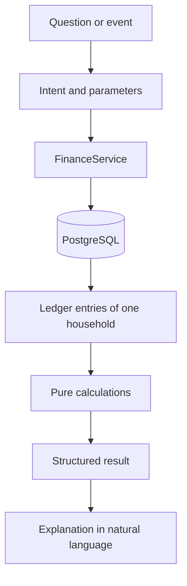

# Finance engine

The finance engine produces every financial figure in the system. It is deterministic: the same transactions and the same reference date always give the same result. No language model takes part in any calculation.



A model may later work out what is being asked and phrase the answer. Everything between those two steps is this engine.

## Structure

```
apps/api/src/finance
├── domain            pure calculations, no I/O
│   ├── period        dates, ranges and time zones
│   ├── ledger        the input type shared by every calculation
│   ├── categories    category hierarchy
│   ├── flow          spending and income breakdowns
│   ├── cash-flow     income, expenses, net and outlook
│   ├── savings       savings and savings rate
│   ├── budget        usage, status and member attribution
│   ├── goals         progress and required saving
│   ├── trends        comparison between periods
│   ├── forecast      projected spending for a period
│   ├── recurring     recurring expense detection
│   ├── anomaly       unusual transactions and categories
│   ├── balances      account balances
│   ├── insights      what is worth surfacing, and how urgently
│   └── finance-policy.ts   every threshold in one place
├── application       FinanceService: loads data for a household and calls the domain
└── infrastructure    LedgerRepository: reads transactions as ledger entries
```

The domain folder and `src/money` may not import NestJS, Drizzle, the database driver, an AI SDK, or the application and infrastructure folders. A lint rule enforces this, so the property cannot erode unnoticed. See [ADR-015](adr/ADR-015-pure-finance-engine.md).

`FinanceService` is the only entry point other modules use. Each of its methods takes a household identifier, and the ledger query behind it always filters by that household. Data is loaded for one household and one currency, then calculated in memory. At household scale a year of transactions is a few thousand rows.

## What it calculates

| Method               | Result                                                                        |
| -------------------- | ----------------------------------------------------------------------------- |
| `spending`, `income` | Total, and breakdowns by member, category and account                         |
| `cashFlow`           | Income, expenses, net, savings and savings rate                               |
| `budgets`            | Usage, status, member attribution and projection for each active budget       |
| `goals`              | Progress, remaining amount, state and required monthly saving                 |
| `spendingTrends`     | A period against its previous equivalent, in total, by category and by member |
| `monthEndForecast`   | Projected spending for the current month                                      |
| `recurringExpenses`  | Detected recurring patterns with their evidence                               |
| `anomalies`          | Unusually large transactions and unusually high category spending             |
| `accountBalances`    | Balance per account, with member, joint and total figures per currency        |
| `insights`           | Structured findings with a severity                                           |
| `currentDate`        | Today's date in the household's time zone                                     |

Results are plain objects of identifiers, integers and dates. None contains prose.

## Money

Amounts are integers in minor units with a currency code ([ADR-012](adr/ADR-012-money-as-integer-minor-units.md)).

- Addition and subtraction are integer operations that fail if a result leaves the exactly representable range.
- Division happens in one place, using arbitrary-precision integers and rounding half away from zero. Multiplication is done before division so no precision is lost.
- A calculation works in one currency. If any entry it receives is in another currency it throws `MixedCurrencyError`, including entries that would not have contributed to the result. There is no conversion.
- A household with accounts in several currencies gets separate results per currency. Methods default to the household's currency and accept another.

## Ratios

Percentages are integers in basis points, where 10 000 is 100%. A budget at 82% has a usage of `8200`, and a 33.33% increase is `3333`. This keeps results free of floating-point values.

A ratio whose denominator is zero is `null`, never zero, `NaN` or `Infinity`. This applies to the savings rate with no income, the change from a previous period of zero, and shares of a zero total.

Threshold comparisons use the exact amounts, not the rounded ratio, so a budget at 149.997% is not treated as having reached 150%.

## Periods and time zones

All date logic lives in `domain/period`.

- A date is a calendar date, `YYYY-MM-DD`, and a period is an inclusive range of dates.
- A transaction's date is the calendar date on which it happened for the household. It carries no time and no zone.
- Arithmetic on dates counts whole days and is unaffected by daylight saving changes.
- Weeks run Monday to Sunday.
- A household has an IANA time zone. It is used for one thing: turning the current instant into "today" for that household. Two households can be in different months at the same instant.
- Calculations take the reference date as an argument and never read the clock, which is what makes them reproducible.

The previous equivalent of a period is:

| Period                | Previous equivalent                                        |
| --------------------- | ---------------------------------------------------------- |
| A full calendar month | The full previous month                                    |
| Month to date         | The same days of the previous month, clamped to its length |
| Any other range       | The range of the same length immediately before it         |

## Spending, income and transfers

Spending is the sum of `EXPENSE` entries and income the sum of `INCOME` entries. `TRANSFER` entries are in neither, by type ([ADR-013](adr/ADR-013-transfers-as-single-transaction.md)).

- **By member.** Grouped by the member who performed the transaction, with each member's share. Every member of the household is listed, including those with nothing, for any number of members.
- **By category.** A transaction counts toward its own category and every ancestor, so `Food` includes `Groceries`. Each category row carries its own member breakdown. Uncategorised amounts form their own row.
- **By account.** Grouped by the account the money left or entered, individual or joint.

`expense_scope` is not used by any calculation yet. It is recorded for the contribution analysis planned with expense splitting.

## Cash flow and savings

```
net = income − expenses
savings = net
savings rate = savings ÷ income
```

Savings can be negative. The savings rate is `null` when there is no income.

## Budgets

For each budget active on the reference date, the engine takes the budget's period containing that date and sums the household's expenses in the budget's category, including subcategories. A budget without a category covers all spending.

| Status        | Rule                                                           |
| ------------- | -------------------------------------------------------------- |
| `NOT_STARTED` | Nothing spent                                                  |
| `ON_TRACK`    | Spent, below the alert threshold                               |
| `NEAR_LIMIT`  | At or above the alert threshold, up to and including the limit |
| `EXCEEDED`    | Above the limit                                                |

The alert threshold is stored on each budget and defaults to 80%. Spending exactly equal to the limit is `NEAR_LIMIT`: the budget is used up, not overrun.

Usage is attributed to members from the transactions. Limits and alerts apply to the household total only ([ADR-010](adr/ADR-010-household-budgets-and-goals.md)).

## Goals

```
remaining = max(target − current, 0)
progress = current ÷ target
```

| State         | Rule                                             |
| ------------- | ------------------------------------------------ |
| `COMPLETED`   | Nothing remains                                  |
| `OVERDUE`     | The target date has passed and something remains |
| `IN_PROGRESS` | Otherwise                                        |

For a goal in progress with a target date, the required monthly saving is the remaining amount spread over the days left, expressed per average month of 365 ÷ 12 days, and never more than the remaining amount. A goal with a non-positive target or a negative saved amount is rejected.

## Trends

A trend compares two amounts: current, previous, difference, change in basis points and a direction. When the previous amount is zero the change is `null` and the direction still reports an increase. Trends are computed in total, per category and per member.

## Forecast

The forecast answers one question: at the end of this period, how much is likely to have been spent? It is a projection, and its result names the method used.

```
projected total = spent so far + projected remainder
```

| Method                 | When                                                    | Projected remainder                                                                                              |
| ---------------------- | ------------------------------------------------------- | ---------------------------------------------------------------------------------------------------------------- |
| `HISTORICAL_REMAINDER` | At least one of the previous three periods has spending | The average of what was spent in the rest of each of those periods, counted from the same number of elapsed days |
| `LINEAR_PACE`          | No usable history                                       | Spent so far ÷ days elapsed × days remaining                                                                     |
| `ACTUAL`               | The period is over                                      | Zero                                                                                                             |

The historical method exists because household spending is not evenly spread. Rent paid on the first of the month would, at a linear pace, project thirty times the rent. Using what the remainder of previous months actually cost handles fixed early payments without modelling them.

Limitations: the forecast knows nothing about planned one-off expenses, treats every past period equally, and with a single period of history simply repeats it. Periods with no spending are ignored on the assumption that the household was not yet recording.

## Recurring expenses

Detection is conservative. Expenses from the last 400 days are grouped by merchant, compared case-insensitively. A group is reported only if all of the following hold:

1. It has at least three occurrences.
2. Every amount is within 10% of the group's median.
3. Every gap between consecutive occurrences fits one cadence.
4. The last occurrence is recent: no more than two cycles ago.

| Cadence   | Gap in days |
| --------- | ----------- |
| Weekly    | 7 ± 1       |
| Monthly   | 30 ± 3      |
| Quarterly | 91 ± 4      |
| Yearly    | 365 ± 5     |

A supermarket visited weekly for varying amounts fails the second rule. A café visited irregularly fails the third. Expenses without a merchant are not considered.

A pattern carries its evidence: the dates, amounts and gaps it was built from. It describes what was observed. It makes no claim that the expense is a subscription or that it is used ([ADR-004](adr/ADR-004-ai-output-validation.md)).

## Anomalies

Both detectors compare against the household's own history and return the figures that triggered them.

**Unusually large transaction.** An expense in the current month is flagged when it is at least three times the median of earlier expenses in the same category over the last 180 days, there are at least five such earlier expenses, and it exceeds the median by at least 5 000 minor units.

**Unusual category spending.** A category's spending so far this month is flagged when it is at least 1.5 times its average over the same number of days in the previous three months, at least two of those months have spending, and the difference is at least 5 000 minor units. A category with no baseline is not flagged.

The median is used instead of the mean so that one earlier outlier does not hide the next. The absolute floor keeps a €15 coffee from being reported for being five times a €3 one.

## Insights

The insight engine decides whether a result deserves attention. It receives results from the other calculations and returns structured insights, most severe first. A transaction that crosses no threshold produces nothing.

| Type                | Raised when                                                                           | Severity                               |
| ------------------- | ------------------------------------------------------------------------------------- | -------------------------------------- |
| `BUDGET_NEAR_LIMIT` | A budget is `NEAR_LIMIT`                                                              | Medium                                 |
| `BUDGET_EXCEEDED`   | A budget is `EXCEEDED`                                                                | High, or critical at 150% of the limit |
| `SPENDING_INCREASE` | A category is up at least 25% and 2 000 minor units on the previous equivalent period | Low, or medium at 50%                  |
| `UNUSUAL_SPENDING`  | An anomaly was detected                                                               | Medium                                 |
| `RECURRING_EXPENSE` | A recurring pattern was detected                                                      | Info                                   |
| `GOAL_PROGRESS`     | A goal is completed or overdue                                                        | Info, or medium when overdue           |
| `CASH_FLOW_WARNING` | Projected spending for the month exceeds expected income                              | High                                   |

Expected income is the larger of this month's income so far and the previous month's income. With no income on record there is no warning.

Each insight has a stable key, such as `BUDGET_EXCEEDED:<budget>:<period start>`. The same finding produces the same key every time it is evaluated, which lets a later phase deliver it once instead of on every transaction.

An insight holds a type, a severity, a key and the result that triggered it. It holds no sentence. Wording belongs to the advisor.

## Policy

Every threshold named in this document is a field of `FinancePolicy` in `domain/finance-policy.ts`, with the defaults stated here. Calculations receive the policy as an argument. No threshold is written into a calculation.

The policy also holds the thresholds of the monthly review: the savings rate regarded as healthy (20%) and as low (5%), and how many categories a review lists ([cfo-intelligence.md](cfo-intelligence.md)).

There is no generic rule engine and no `financial_rules` table. Rules are typed functions. A threshold that needs to vary per household would become a column or a policy override at that point.

## Deterministic, and what is left to AI

| Deterministic, in this engine                          | Delegated to a model later             |
| ------------------------------------------------------ | -------------------------------------- |
| Every amount, total, share, percentage and balance     | Understanding what a message is asking |
| Which period a question refers to, once named          | Choosing which calculation answers it  |
| Budget status, goal state, trend direction             | Phrasing a result as a sentence        |
| Whether something is recurring or unusual              | Tone, emphasis and suggestions         |
| Whether a finding is worth surfacing, and its severity | Conversation                           |
| Projections                                            |                                        |

A model never receives raw transactions to add up. It receives the results described here.

## Testing

The domain is covered by unit tests that need nothing but the functions themselves. `test/finance.int-spec.ts` runs `FinanceService` against PostgreSQL with several households of different sizes, and verifies that no calculation for one household is affected by another's data.
