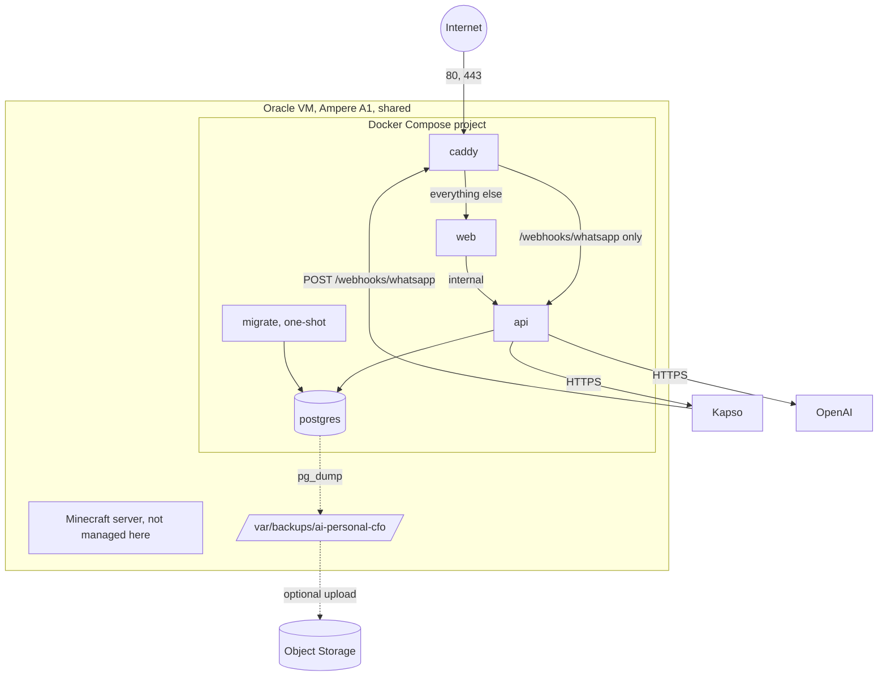

# Infrastructure

The CFO runs as four containers on one existing Oracle Cloud VM that it shares with a Minecraft server. Everything here is sized and scoped so that the CFO is a guest on that machine, not its owner.

## Environments

| Environment       | Where                                                    | Database                                | Model and WhatsApp                     |
| ----------------- | -------------------------------------------------------- | --------------------------------------- | -------------------------------------- |
| Local development | Your machine, `npm run start:dev` and `next dev`         | `docker-compose.dev.yml` on `127.0.0.1` | Placeholders or your own keys          |
| CI                | GitHub Actions                                           | A PostgreSQL service container          | Fakes only                             |
| Local stack check | Your machine, the production Compose stack on high ports | Its own volume                          | Fake-looking values; nothing is called |
| Production        | The Oracle VM                                            | A container with a named volume         | Real credentials, in `.env` on the VM  |

There is no staging environment. The local stack check, described in [deployment.md](deployment.md#trying-the-stack-locally), is the closest thing to one.

## Production layout

| Container  | Image                 | Networks       | Published ports  | Runs as                                                 |
| ---------- | --------------------- | -------------- | ---------------- | ------------------------------------------------------- |
| `caddy`    | `caddy:2-alpine`      | `edge`         | 80, 443, 443/udp | root, all capabilities dropped except binding low ports |
| `web`      | Built from `apps/web` | `edge`         | None             | `node`, read-only filesystem                            |
| `api`      | Built from `apps/api` | `edge`, `data` | None             | `node`, read-only filesystem                            |
| `migrate`  | The API image         | `data`         | None             | `node`, read-only filesystem, exits when done           |
| `postgres` | `postgres:17-alpine`  | `data`         | None             | The image's `postgres` user                             |

The `data` network is internal: it has no route to the internet, and only `api`, `migrate` and `postgres` are on it. PostgreSQL publishes no port and cannot be reached from the host's network interfaces, from `web` or from `caddy`.

When the machine already has a reverse proxy on ports 80 and 443, the `caddy` container is left out and that proxy serves the CFO's host name instead, over a shared Docker network. See [deployment.md](deployment.md#sharing-ports-80-and-443-with-another-proxy).

Caddy forwards exactly one path to the API, the WhatsApp webhook. The API's health, sign-in and dashboard routes are reachable only from inside the Docker network, where the web application uses them.

## Resource budget

The VM has about 2 OCPU and 12 GB of memory. The limits below are ceilings, not reservations, and are set in `infra/docker/compose.yml`.

| Container  | Memory limit | Memory reserved | CPU limit |
| ---------- | ------------ | --------------- | --------- |
| `postgres` | 768 MB       | 256 MB          | 0.30      |
| `api`      | 512 MB       | 192 MB          | 0.40      |
| `web`      | 384 MB       | 128 MB          | 0.30      |
| `caddy`    | 128 MB       | 32 MB           | 0.10      |
| Total      | 1 792 MB     | 608 MB          | 1.10      |

`migrate` may use up to 256 MB and 0.30 CPU for the few seconds it runs.

PostgreSQL is configured to match its limit: 128 MB of shared buffers and at most 30 connections.

That leaves roughly 10 GB of memory and, under sustained CFO load, about half of the CPU for Minecraft, the operating system, Docker and the file cache. In normal use the CFO is idle almost all the time and uses well under its limits: on a development machine the four containers together used about 120 MB when idle. How much memory the Minecraft JVM is given is decided outside this project and is not changed by it. If Minecraft is configured to use most of the machine, lower these limits rather than raising them.

## Host requirements

These are prerequisites on the VM. None of them is automated, because the machine is shared and a mistake here affects Minecraft.

| Requirement      | Detail                                                                                              |
| ---------------- | --------------------------------------------------------------------------------------------------- |
| Architecture     | ARM64. The images are built for `linux/arm64` only                                                  |
| Docker           | Docker Engine with the Compose plugin, from Docker's `arm64` repository. Version 24 or later        |
| Packages         | `curl`, `rsync`, `bash`. The deploy and backup scripts use nothing else                             |
| Disk             | About 2 GB for images, plus the database and 14 days of backups. Keep 5 GB free                     |
| Swap             | 2 to 4 GB of swap is recommended so that a spike in either workload does not trigger the OOM killer |
| Deploy user      | A non-root user in the `docker` group, with the deploy key in `authorized_keys`                     |
| Stack directory  | `/opt/ai-personal-cfo`, owned by the deploy user                                                    |
| Backup directory | `/var/backups/ai-personal-cfo`, owned by the deploy user, mode `700`                                |

Before adding swap, check whether the machine already has some with `swapon --show`. Adding a swap file is a routine change but should be done by hand, at a quiet time for Minecraft.

Membership of the `docker` group is equivalent to root on the host. The deploy key should be used for nothing else.

## Network and firewall

Three layers decide what reaches the VM.

| Layer                      | What the CFO needs                     | Managed by                                                     |
| -------------------------- | -------------------------------------- | -------------------------------------------------------------- |
| OCI security list or group | TCP 80, TCP 443, optionally UDP 443    | [Terraform](../infra/terraform/README.md), as a separate group |
| Host firewall              | The same ports                         | You, by hand                                                   |
| Docker                     | Publishes 80 and 443 from `caddy` only | `compose.yml`                                                  |

SSH and the Minecraft ports are already open and are not touched by any of this.

Oracle's images ship with host firewall rules that reject most inbound traffic. Docker publishes ports through its own chains, which usually take effect regardless, but this differs between images. After the first deployment, test from outside. If 80 and 443 do not answer, add rules for those two ports only. Never flush or reset the firewall: that would also remove the rules Minecraft relies on.

Do not open 5432. Nothing needs it.

## DNS

Create an `A` record for the CFO's domain pointing at the VM's public address, which `terraform output instance_public_ip` prints. Add an `AAAA` record only if the VM has a public IPv6 address and port 443 is open for it.

Caddy obtains a certificate from Let's Encrypt the first time it starts with a domain that resolves to the machine and is reachable on ports 80 and 443. Until DNS has propagated the certificate request fails and Caddy retries on its own.

## Images

Both images are multi-stage builds on `node:22-alpine`. The build stage installs all dependencies and compiles. The runtime stage contains only production dependencies and compiled output: no TypeScript, no tests, no development server. The web image uses Next.js's standalone output. No secret is present at build time, and none is copied into an image.

Images are published to GitHub Container Registry and tagged with the full commit SHA. There is no `latest` tag, so what runs is always identifiable.
