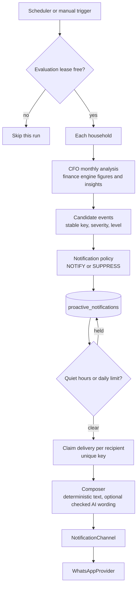

# Proactive CFO

Until this point the assistant only spoke when spoken to. The proactive layer lets it raise something on its own: a budget about to run out, an expense far outside the household's habits, a goal past its date.

It is not an agent. It evaluates figures the finance engine already produces, applies a fixed policy to decide whether each finding deserves a message, and sends at most one message per finding and recipient. It takes no action on the household's money, and the model has no part in deciding what is sent.

## Flow

| Step                | Code                                              | Notes                                                        |
| ------------------- | ------------------------------------------------- | ------------------------------------------------------------ |
| Trigger             | `proactive/proactive-scheduler.ts`                | In-process timer, or `npm run proactive:evaluate`            |
| Orchestration       | `proactive/proactive-cfo.service.ts`              | Lease, households, registration, delivery                    |
| Figures             | `CfoService.monthlyAnalysis`                      | The same analysis the review and the dashboard use           |
| Candidates          | `proactive/proactive-candidates.ts`               | Pure. Turns insights and review facts into events            |
| Policy              | `proactive/proactive-policy.ts`                   | Pure. All thresholds in one object                           |
| State               | `proactive/proactive-notifications.repository.ts` | The only persistence in the layer                            |
| Wording             | `proactive/notification-composer.ts`              | The only place the model is involved                         |
| Channel abstraction | `proactive/notification-channel.ts`               | Provider-agnostic interface                                  |
| WhatsApp adapter    | `whatsapp/whatsapp-notification-channel.ts`       | Resolves addresses and calls the existing `WhatsAppProvider` |

The finance engine, the financial domain modules and the CFO review know nothing about notifications. The notification layer performs no financial calculation: every amount it shows was computed by the finance engine and formatted by the same code the dashboard uses.

## Events

Events are built from the monthly analysis of the current month in the household's time zone, once per currency. Most are the finance engine's existing insights. Two are derived from facts already in the review.

| Event                       | Source                                                 | Severity           |
| --------------------------- | ------------------------------------------------------ | ------------------ |
| `BUDGET_NEAR_LIMIT`         | Insight: budget past its alert threshold               | `MEDIUM`           |
| `BUDGET_EXCEEDED`           | Insight: budget over its limit                         | `HIGH`, `CRITICAL` |
| `BUDGET_FORECAST_RISK`      | Review: a budget still on track, projected to run over | `MEDIUM`           |
| `SPENDING_INCREASE`         | Insight: a category well above the previous period     | `LOW`, `MEDIUM`    |
| `UNUSUAL_SPENDING`          | Insight: an anomaly against the household's history    | `MEDIUM`           |
| `CASH_FLOW_WARNING`         | Insight: projected spending above expected income      | `HIGH`             |
| `GOAL_PROGRESS`             | Insight: a goal reached, or past its date              | `INFO`, `MEDIUM`   |
| `RECURRING_EXPENSE`         | Insight: an established recurring charge exists        | `INFO`             |
| `NEW_RECURRING_EXPENSE`     | Insight: a recurring charge was newly established      | `MEDIUM`           |
| `RECURRING_PRICE_INCREASE`  | Insight: a recurring charge costs more than before     | `MEDIUM`           |
| `RECURRING_EXPENSE_STOPPED` | Insight: a recurring charge appears to have stopped    | `MEDIUM`           |
| `RECURRING_EXPENSE_DUE`     | Review: a recurring charge expected within 3 days      | `LOW`              |

### Stable keys

Every event has a key that is the same each time the same situation is evaluated. Keys are built from the currency, the kind of event, its subject and its period, never from the time of evaluation.

| Event               | Key                                                                                                              |
| ------------------- | ---------------------------------------------------------------------------------------------------------------- |
| Budget usage        | `<currency>:BUDGET:<budget>:<period start>`                                                                      |
| Budget forecast     | `<currency>:BUDGET_FORECAST:<budget>:<month start>`                                                              |
| Recurring due       | `<currency>:RECURRING_DUE:<merchant>:<expected date>`                                                            |
| Recurring lifecycle | `<currency>:<event>:<merchant>:<cadence>:<transaction date>`. See [recurring-expenses.md](recurring-expenses.md) |
| Any other insight   | `<currency>:<insight key>`                                                                                       |

"Near its limit" and "exceeded" share one key for a budget and period, because they are stages of the same situation. What distinguishes them is the level.

### Levels

A level is a positive integer that only has meaning within one key. It rises when the situation has materially worsened.

| Budget usage                  | Level |
| ----------------------------- | ----- |
| Past the alert threshold      | 1     |
| At or above 90% of the limit  | 2     |
| Over the limit                | 3     |
| At or above 150% of the limit | 4     |

For every other event the level follows the severity. A budget at 82% for three days stays at level 1 and is notified once. The same budget reaching 95% moves to level 2 and is notified again.

## Notification policy

`decideNotification` takes a candidate, the stored state for its key, the current instant and the policy. It reads nothing else, so the same inputs always give the same decision.

| Situation                                         | Decision                              |
| ------------------------------------------------- | ------------------------------------- |
| New event, severity `MEDIUM` or above             | Notify                                |
| New event, severity `INFO` or `LOW`               | Record for the dashboard, do not send |
| Same or lower level than already recorded         | Suppress                              |
| Higher level, but notified less than 12 hours ago | Suppress for now, reconsider next run |
| Higher level, `CRITICAL`                          | Notify immediately                    |
| Higher level, cooldown over                       | Notify                                |

A second function, `deliveryHold`, decides whether a notification that should be sent may be sent now.

| Rule        | Value                                       | Applies to `CRITICAL` |
| ----------- | ------------------------------------------- | --------------------- |
| Quiet hours | 22:00 to 08:00 in the household's time zone | No                    |
| Daily limit | 3 notifications per household in 24 hours   | No                    |

A held notification stays `PENDING` and is delivered by a later run. More severe notifications are delivered first, so the daily limit is spent on what matters most.

All values live in `PROACTIVE_POLICY`. There are no per-household preferences yet; the policy is the same for everyone.

## Recipients

A notification belongs to a household and goes to every member of that household who has a WhatsApp identity. One member, two members and ten members are the same case. A member with no registered identity receives nothing, and a household where nobody is reachable still gets the record on its dashboard.

The address is never stored with the notification. At send time the adapter looks up the addresses of that household's members and sends only to one of them. A member of another household cannot be a recipient: the lookup is scoped by household, and `notification_deliveries` has a composite foreign key on `(household_id, member_id)`.

## State and idempotency

| Table                     | Holds                                                                                                  | Unique key                                     |
| ------------------------- | ------------------------------------------------------------------------------------------------------ | ---------------------------------------------- |
| `proactive_notifications` | One row per household and event key: type, severity, level, title, body, status, timestamps, read mark | `(household_id, event_key)`                    |
| `notification_deliveries` | One row per notification, member, channel and level: status and attempts                               | `(notification_id, member_id, channel, level)` |
| `evaluation_leases`       | Who is evaluating, and until when                                                                      | `name`                                         |

A notification stores the sentence shown to the household. It stores no ledger rows, no raw amounts, no addresses and no credentials.

| Status       | Meaning                                                                            |
| ------------ | ---------------------------------------------------------------------------------- |
| `PENDING`    | Should be sent. Waiting for a run, for quiet hours to end or for the daily limit   |
| `SENT`       | Reached at least one member                                                        |
| `FAILED`     | Every attempt so far failed                                                        |
| `SUPPRESSED` | Recorded for the dashboard only: below the severity threshold, or nobody reachable |

Three mechanisms keep a message from being sent twice:

- Creating a notification is an insert that ignores a conflict on the event key. Raising its level is an update that only succeeds while the stored level is lower.
- Before sending, the run claims the delivery by inserting its row. A second run, or a second process, gets no row back and sends nothing.
- A whole run takes a lease in the database. A second run started while the first is working is skipped. If a process dies, its lease expires after 10 minutes and the next run takes over.

Running the same evaluation twice, or six at once, produces one message per recipient.

### Delivery failures

A failed send marks the delivery `FAILED` and keeps the notification. The next run retries it, up to 3 attempts in total, then stops and marks the notification `FAILED` with the reason `DELIVERY_EXHAUSTED`. A member who already received a message is not sent it again while another member's delivery is retried.

A delivery is claimed before the send, so a process that dies between the claim and the provider's answer leaves the delivery unresolved, and it is not retried. The system prefers missing a message to sending one twice.

## Wording and the model

Every notification has a deterministic text: the title and the detail, as shown on the dashboard. That text is always enough to send.

With `PROACTIVE_AI_MESSAGES=true` the composer asks the model to phrase the notification, through the existing `AIProvider.composeReply`. The model receives the event type, severity, period, title and detail. It receives no identifiers and no other household data.

- The decision to send was made before the model is called, and the stored severity is never read back from its answer.
- The answer is checked with the same figure guard as every other reply. Any number that is not in the facts discards it.
- An empty answer, an overlong answer or a provider failure discards it.

When the answer is discarded the deterministic text is sent. A notification is never withheld because the model is unavailable.

## Scheduling

| Mechanism                                | When it runs                                              |
| ---------------------------------------- | --------------------------------------------------------- |
| In-process timer                         | Every 60 minutes when `PROACTIVE_EVALUATION_ENABLED=true` |
| `npm run proactive:evaluate -w apps/api` | Once, for use from cron or a systemd timer                |

Both go through `ProactiveScheduler.trigger`, which refuses to overlap within a process, and `ProactiveCfoService.evaluateAll`, which takes the database lease. Running the timer in two processes, or the timer and cron together, is safe.

The timer holds no state. After a restart the next run reads everything it needs from the database: what was already notified, what is pending, which deliveries failed. Evaluation is off by default, so a development server sends nothing.

A failure in one household is logged without its content and does not stop the others.

## Dashboard

The Signals page lists the household's most recent notifications below the month's insights, read from the same `proactive_notifications` rows: title, detail, severity, delivery status and date. A member can mark one as read. A notification that escalates becomes unread again.

| Route                                     | Purpose                                               |
| ----------------------------------------- | ----------------------------------------------------- |
| `GET /dashboard/notifications`            | The 50 most recent notifications of the household     |
| `POST /dashboard/notifications/:key/read` | Mark one as read. `404` if it is not this household's |

Both take the household from the session, like every other dashboard route.

## Configuration

| Variable                       | Default | Purpose                                                   |
| ------------------------------ | ------- | --------------------------------------------------------- |
| `PROACTIVE_EVALUATION_ENABLED` | `false` | Run the in-process timer                                  |
| `PROACTIVE_AI_MESSAGES`        | `false` | Let the model phrase notifications, with the checks above |

## Limitations

- WhatsApp only accepts free-form messages within 24 hours of the member's last message. Outside that window the provider rejects the send, the delivery fails and is retried up to the limit. Approved message templates are not implemented.
- There are no per-household or per-member preferences. Quiet hours, the severity threshold and the daily limit are the same for all households.
- Events are evaluated for the current month only. A finding about a month that has ended is not raised afterwards.
- A household where nobody is reachable has its notifications recorded as dashboard-only. Registering an identity later does not send them retroactively.
- Evaluation visits households one after another in a single process. This is adequate for a self-hosted installation and would need batching for many households.
- The existing `insights` table is still unused. Notification state lives in `proactive_notifications`.
- Nothing has been exercised against the live WhatsApp provider or a live model.
