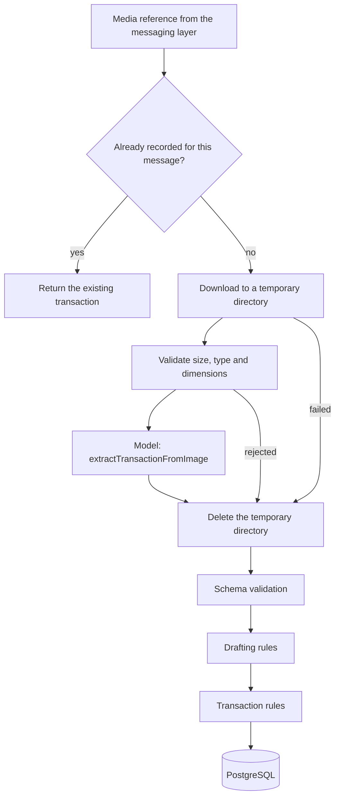

# Image extraction

A member can send a photo or screenshot of a receipt, a transfer or a payment, and the system records the transaction it shows. The image is an input and nothing more. It is held on disk for the seconds it takes to read, then deleted. Only the structured transaction is kept.



Everything from schema validation onward is the same pipeline that handles text messages ([ai-integration.md](ai-integration.md)). An image reading produces the same transaction candidate, passes the same drafting rules and is recorded by the same `TransactionsService`.

## Structure

```
apps/api/src
├── media
│   ├── media-source.ts            the MediaSource interface and MediaError
│   ├── image-inspection.ts        type and dimensions from the file's bytes
│   ├── media-policy.ts            size and dimension limits
│   └── temporary-media-store.ts   download, validate, hand over, delete
├── ai/vision
│   ├── image-extraction.schema.ts
│   ├── image-extraction-instructions.ts
│   └── image-transaction-reader.ts
└── conversation/image
    └── image-transaction.service.ts   orchestration
```

`FinancialAssistant.handleImage(context, { media, caption, sourceMessageId }, instant)` is the entry point. Like the text entry point, it is called by the messaging integration once the sender has been resolved.

## Where images come from

The image layer does not know about WhatsApp. It depends on one interface:

```ts
interface MediaSource {
  download(request: {
    reference: { provider: string; mediaId: string };
    destinationPath: string;
    maximumBytes: number;
  }): Promise<void>;
}
```

A media reference is an opaque identifier issued by the messaging provider. It is not a URL. The image layer contains no code that fetches from the network, so there is no address a caption, an image or a model could supply that would be fetched. Turning a reference into bytes is the job of a `MediaSource` implementation that talks only to its own provider ([ADR-018](adr/ADR-018-temporary-media.md)).

The implementation for WhatsApp is `KapsoMediaSource`, described in [whatsapp-integration.md](whatsapp-integration.md).

## Temporary storage lifecycle

`TemporaryMediaStore.withImage(reference, use)` owns the whole life of a file.

1. A directory with a random name is created under the system temporary directory, readable only by the process owner.
2. The media source writes the download into it.
3. The file is validated.
4. Its bytes are handed to the caller, which sends them to the model.
5. The directory is deleted.

Step 5 is in a `finally` block. It runs when the caller returns, when the caller throws, when the download fails part-way, and when validation rejects the file.

| Guarantee                                             | How                                                                |
| ----------------------------------------------------- | ------------------------------------------------------------------ |
| Deleted after success                                 | `finally`                                                          |
| Deleted after a provider timeout or any other failure | `finally`                                                          |
| Deleted after a rejected file                         | `finally`                                                          |
| Deleted after a crash                                 | On startup the store removes its whole root directory              |
| Never shared between requests                         | One random directory per image                                     |
| Never in the database                                 | No table has a binary column, and nothing writes image data to one |
| Never in the repository                               | The files live in the operating system's temporary directory       |

The image is deleted as soon as the model has returned, before the transaction is validated or written. By the time anything is stored in PostgreSQL the image no longer exists.

The conversation history records that an image was sent as the text `[image]`, followed by the caption if there was one. It does not record the image, its reference or its location.

## Validation

Uploaded files are untrusted. Validation happens before any model is called, and a rejected file never leaves the machine.

| Check      | Rule                                                                                                   |
| ---------- | ------------------------------------------------------------------------------------------------------ |
| Download   | Must produce a regular file                                                                            |
| Size       | More than zero bytes and at most 10 MB. The limit is passed to the source and checked again afterwards |
| Type       | Detected from the file's leading bytes. Must be JPEG, PNG or WebP                                      |
| Dimensions | Read from the image header. Each side between 32 and 10 000 pixels                                     |

The type is taken from the content and nothing else. A declared content type and a file name are never consulted, so a PDF or an HTML page cannot pass by claiming to be an image. The detected type is what the model is told.

There is no image-processing library and no resizing or conversion. The three accepted formats are sent as they are.

PDFs, GIFs, SVGs and other documents are rejected as unsupported.

## What the model is asked

`AIProvider.extractTransactionFromImage` is a dedicated operation. It returns one of four readings:

| Reading                 | Meaning                                         | Result                                                                  |
| ----------------------- | ----------------------------------------------- | ----------------------------------------------------------------------- |
| `SINGLE_TRANSACTION`    | One transaction, with a candidate               | Goes through the drafting rules                                         |
| `MULTIPLE_TRANSACTIONS` | A statement or list                             | Nothing is recorded. The member is told and asked to send one at a time |
| `NOT_FINANCIAL`         | Not a financial document                        | Nothing is recorded                                                     |
| `UNREADABLE`            | Too blurred, dark or cropped to read the amount | Nothing is recorded                                                     |

The candidate is the same schema used for text: type, amount as decimal text, currency, merchant, description, category, account, transfer account, payment method, date reference and confidence.

The instructions are generic. They describe kinds of documents and what to copy from them, and they name no bank, merchant or layout.

### Supported scenarios

| Image                                            | Recorded as                               |
| ------------------------------------------------ | ----------------------------------------- |
| Supermarket or restaurant receipt                | An expense for the total paid             |
| Card payment confirmation or app screenshot      | An expense                                |
| Salary or payment notice                         | Income                                    |
| Transfer between two of the household's accounts | A transfer, which is not spending         |
| Statement or activity list                       | Nothing. Reported as several transactions |

A receipt with many items is one transaction: its total. Items are not stored.

## Rules that are reused

Nothing about an image is trusted more than a text message.

- **Amount.** Copied as printed and converted to minor units by the application. Text that is not a plain decimal number, such as `1,250.00`, is rejected and asked about.
- **Currency.** The one shown if it matches the account, otherwise the account's. A different currency is never converted.
- **Category.** Must be an existing category of the right kind. Required for an expense. When the model is unsure it returns none, and the reply says what was identified and offers the categories.
- **Account.** The model may report an account name it can see. The application resolves it only among the sender's household's accounts, then falls back to the sender's default account, then the household's only account, then asks ([ADR-017](adr/ADR-017-account-resolution.md)).
- **Date.** The model returns a complete date only when the image shows one unambiguously. A date that is incomplete or whose day and month could be either way is reported as unresolved, and the member is asked. An image with no date is taken to be from the day it was sent. A future date is asked about.
- **Confidence.** Below `AI_CONFIDENCE_THRESHOLD` the reading is confirmed with the member. High confidence skips no check.
- **Identity.** The household and member come from the request context. A reading that includes identifiers has them dropped by schema validation.

## Duplicates

If an image message carries a provider message identifier and a transaction with that identifier already exists in the household, the existing transaction is returned. The image is not downloaded and no model is called.

This is a lookup on a column the transaction already has. It is not a second idempotency mechanism: two simultaneous deliveries could both pass it. The guarantee against duplicate deliveries is the `webhook_events` record made by the messaging layer before any of this runs.

Retries of a failed request to the model happen inside one call and produce at most one reading, so they cannot record twice.

## Privacy

Sent to the model: the image, the caption, and the names of the household's accounts and categories.

Not sent: conversation history, other members' names, transactions, balances, identifiers.

Requests are made with `store: false`, which asks OpenAI not to retain them. The image is sent inline in the request and is not uploaded as a file to OpenAI.

Logged: the operation, its outcome and its duration. Image contents, references, paths and download errors are not logged.

## Outcomes

| Situation                                                                           | Outcome                                            | Recorded                         |
| ----------------------------------------------------------------------------------- | -------------------------------------------------- | -------------------------------- |
| Valid reading that passes every rule                                                | `RECORDED`                                         | Yes                              |
| Same message identifier seen before                                                 | `ALREADY_RECORDED`                                 | No, the existing one is returned |
| Something missing, ambiguous or below the confidence threshold                      | `NEEDS_CLARIFICATION` with reasons                 | No                               |
| Several transactions in one image                                                   | `NEEDS_CLARIFICATION` with `MULTIPLE_TRANSACTIONS` | No                               |
| Download failed, storage failed, empty, too large, unsupported type, bad dimensions | `IMAGE_NOT_USABLE` with the reason                 | No                               |
| Not financial, or unreadable                                                        | `IMAGE_NOT_USABLE` with the reason                 | No                               |
| Model timed out, was rate limited, was unavailable or returned invalid output       | `AI_UNAVAILABLE`                                   | No                               |

The member always receives a reply. Provider and download errors are never shown.

## Limitations

- One transaction per image. Statements are detected and declined.
- No item-level data from receipts.
- No PDFs or multi-page documents.
- A foreign-currency receipt paid from an account in another currency is asked about, not converted.
- Handwritten or very poor images depend on the model. When it cannot read the amount reliably it is instructed to say so.
- The reply to an image without a caption has no member text to take a language from.
- The real API has not been exercised with images in this repository's tests. The provider is tested against a local stand-in for the API.

## Future extensions

| Extension                   | Shape                                                                                                  |
| --------------------------- | ------------------------------------------------------------------------------------------------------ |
| Multi-transaction documents | A batch reading with a list of candidates, confirmed by the member before recording                    |
| Receipt items               | A separate table referencing the transaction                                                           |
| PDF statements              | A document reader behind the same media abstraction                                                    |
| Keeping receipts            | Object storage and a reference on the transaction, as an explicit feature with its own retention rules |
