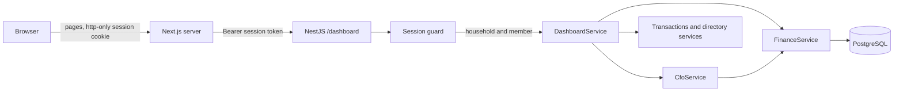

# Web dashboard

The dashboard is the household's view of its own finances in a browser: where the month stands, where the money went, how budgets and goals are doing, what is projected, and what the review says. Members can correct and delete transactions, and create, edit and delete budgets and goals ([ADR-029](adr/ADR-029-dashboard-writes.md)). Transactions are still recorded through WhatsApp.

Every figure on every page is calculated by the backend. The web application renders what it is given.



## Responsibilities

| Backend                                             | Web application                 |
| --------------------------------------------------- | ------------------------------- |
| Authentication and the household of a session       | Holding the session cookie      |
| Every amount, total, share, percentage and balance  | Rendering them                  |
| Which month a request means, and which months exist | Offering those months           |
| Comparisons, budget status, goal state, forecasts   | Layout and wording of labels    |
| Recurring expenses, anomalies, insights, the review | Empty, loading and error states |
| Formatting money and percentages as text            |                                 |
| Names for categories, accounts, members and goals   |                                 |

The web application contains no financial calculation, no threshold, no currency formatting and no date arithmetic. It does not import backend code other than the types of the API contract. Tests on both sides enforce this.

## Authentication and authorization

A member signs in with an email and a password and receives a session ([ADR-022](adr/ADR-022-dashboard-sessions.md), [ADR-028](adr/ADR-028-email-and-password-sign-in.md)).

1. An operator registers the member's email and issues an access code. The code is shown once and only its hash is stored.
2. On the first access page the member enters the code, their email and a new password. The code is then used up. Afterwards they sign in with email and password, which the phone saves and fills.
3. The Next.js server exchanges the credentials with the API for a session token.
4. The token is set as an http-only, same-site cookie. Browser scripts cannot read it.
5. On every page request the Next.js server sends the token to the API as a bearer token.
6. The API's session guard resolves the token to a household and a member, the same request context the WhatsApp flow uses.

```sh
cd apps/api
HOUSEHOLD_NAME="Demo Household" MEMBER_NAME="Member A" EMAIL="a@example.com" npm run auth:register-email
HOUSEHOLD_NAME="Demo Household" MEMBER_NAME="Member A" npm run auth:issue-access-code
```

Issuing a new code for a member replaces the old one and ends that member's sessions. `npm run auth:revoke-access` removes a member's access altogether. Sessions last seven days and end on sign-out. Session tokens are stored as hashes. The full set of controls is in [security.md](security.md).

The browser never talks to the API directly and never holds an identifier.

- No endpoint accepts a household or member as a parameter. A `householdId` in a query string is ignored.
- The household comes only from the session, and every service call is scoped by it.
- Filter keys for transactions are looked up inside the session's household. A key from another household matches nothing.
- Members of a household see the same data. There is no private view.

## API

All routes require a session. The views are `GET` and take an optional `month=YYYY-MM`, except the notification routes and the routes that change data.

| Route                                     | Returns                                                                                                                                                                                 |
| ----------------------------------------- | --------------------------------------------------------------------------------------------------------------------------------------------------------------------------------------- |
| `/dashboard/session`                      | Member and household names, currency, time zone, today, selectable months                                                                                                               |
| `/dashboard/overview`                     | Totals, comparison, top categories, members, budgets, forecast, balances, findings                                                                                                      |
| `/dashboard/spending`                     | Total, categories, members, accounts, biggest changes, largest expenses                                                                                                                 |
| `/dashboard/income`                       | Total, sources, members, comparison                                                                                                                                                     |
| `/dashboard/budgets`                      | Each budget with usage, status, projection and member attribution                                                                                                                       |
| `/dashboard/goals`                        | Each goal with progress, remainder and state                                                                                                                                            |
| `/dashboard/outlook`                      | Forecast, cash-flow outlook, budgets projected over, recurring commitments                                                                                                              |
| `/dashboard/signals`                      | Insights and anomalies, described                                                                                                                                                       |
| `/dashboard/review`                       | The monthly review narrative and whether it came from the model                                                                                                                         |
| `/dashboard/transactions`                 | A page of transactions, with filters `type`, `category`, `account`, `member`, `q` (merchant or description), `from` and `to` (at most 366 days, replacing the month), `sort` and `page` |
| `/dashboard/accounts`                     | Accounts with balances and ownership, totals per currency, members                                                                                                                      |
| `/dashboard/recurring`                    | Recurring commitments per currency with totals, upcoming charges, price changes and stopped ones. Takes `sort`, not `month`                                                             |
| `/dashboard/notifications`                | The household's recent proactive notifications with status and read mark. Not tied to a month                                                                                           |
| `/dashboard/evolution`                    | Income, spending and net for the last 6 or 12 months (`months=6\|12`), with bar heights in basis points of the largest month. Not tied to a month                                       |
| `/dashboard/compare`                      | Two months side by side (`a`, `b`, defaulting to the previous and the current month): totals and top-level categories, with changes and bar widths                                      |
| `/dashboard/members`                      | The household's members, to open one                                                                                                                                                    |
| `/dashboard/members/:key`                 | One member's month: spending, income, share of the household's spending, change from the previous month, categories and largest expenses                                                |
| `/dashboard/transactions/export`          | The same filters as the list, as a CSV file of at most 5 000 rows                                                                                                                       |
| `POST /dashboard/notifications/:key/read` | Marks one notification as read                                                                                                                                                          |

Routes that change data ([ADR-029](adr/ADR-029-dashboard-writes.md)):

| Route                                     | Does                                                                          |
| ----------------------------------------- | ----------------------------------------------------------------------------- |
| `GET /dashboard/transactions/:key`        | One transaction as an edit form, with its version and the household's options |
| `PATCH /dashboard/transactions/:key`      | Saves an edit                                                                 |
| `DELETE /dashboard/transactions/:key`     | Deletes the transaction                                                       |
| `POST /dashboard/budgets`                 | Creates a budget                                                              |
| `GET /dashboard/budgets/:key`             | One budget as an edit form                                                    |
| `PATCH`, `DELETE /dashboard/budgets/:key` | Saves an edit, or deletes the budget and suppresses its unsent alerts         |
| `POST /dashboard/goals`                   | Creates a goal                                                                |
| `GET /dashboard/goals/:key`               | One goal as an edit form                                                      |
| `PATCH`, `DELETE /dashboard/goals/:key`   | Saves an edit, or deletes the goal                                            |

- Bodies carry amounts as typed text (`12,50`, `1.234,56`), read in the currency of the account, budget or goal.
- A save returns `{ key, version }`. An out-of-date version gets `409` with `{ code: "STALE" }`. A refused field gets `422` with `{ errors: [{ field, code }] }`.
- A key from another household, or one that does not exist, gets `404`.
- The spending view includes the composition of spending by top-level category, at most six slices with the rest grouped, each with its share and where it starts on a ring, in basis points. The budgets view gives each budget the share of its period already elapsed and whether spending runs faster, on pace or slower.
- The CSV file opens in a spreadsheet with accents intact (UTF-8 with a byte order mark). Portuguese households get semicolons and decimal commas. A cell that starts with `=`, `+`, `-` or `@` is prefixed with an apostrophe so it is never run as a formula.
- The budgets and goals views include the options their forms need: categories, currencies, periods or types, and defaults.

Sessions: `POST /auth/sessions` with an access code, and `DELETE /auth/sessions/current`.

### Contracts

Each response is a view written for the dashboard, defined as a Zod schema in `apps/api/src/dashboard/dashboard.contracts.ts`. `DashboardService` builds a response from service results and parses it against its schema before returning it, which both validates it and removes anything the schema does not name.

- An amount is `{ minor, text }`: the exact integer and its formatted text, such as `€2,220.00`.
- A ratio is `{ basisPoints, text }`, such as `82%`, or `null` when it does not exist.
- Categories, accounts, members and goals appear by name.
- Internal identifiers appear only as `key`: on filter and form options, and on transaction, budget and goal rows. The browser only sends a key back.

The web application imports the TypeScript types of these schemas and nothing else from the backend.

### Where the figures come from

`DashboardService` has no calculation of its own. Most views are slices of the monthly analysis that `CfoService` assembles from `FinanceService` ([cfo-intelligence.md](cfo-intelligence.md)). The review comes from `CfoService.monthlyReview`. Largest expenses, balances and the transaction list come from their services directly. Query parameters are validated with Zod, and a month that is malformed or has not started is rejected.

## Look, language and navigation

- **Themes.** Light and dark follow the device setting through `prefers-color-scheme`. Colours are semantic CSS variables in `app/globals.css`, mapped into Tailwind with `@theme inline`, so every component switches theme without its own dark classes.
- **Language.** The dashboard's own labels come from a dictionary per language in `lib/i18n/`, chosen from `session.locale`, which the API takes from the household. Text produced by the API (categories, alerts, findings, months, amounts) is already in that language. Dates show as `DD/MM/YYYY` in Portuguese. The sign-in page follows the browser's language.
- **Phones.** A bottom bar holds Overview, Transactions, Budgets and Goals; the rest open from a "More" sheet. Transactions show as cards below the `md` breakpoint and as a table above it, and filters collapse. No page scrolls sideways at 390 px.
- **Larger screens.** A floating rail on the left holds the sections as icons only, grouped by thin dividers. Pointing at an icon or focusing it with the keyboard shows its name in a label that slides between icons; each link also carries the name as `aria-label`. A brass mark shows the current section. The household's name sits in the header, and the month is chosen with previous and next buttons around a selector.
- **Charts.** Bars, rings and markers are drawn from basis points the API already scaled (bar heights, ring shares and offsets, elapsed share of a budget period). The browser only turns basis points into CSS percentages; it adds, compares and rounds nothing. Every chart has the same figures as text or in a visually hidden table, and hover effects are CSS only.
- Each request fetches the session once (`lib/session.ts`, cached per request), and server components receive the dictionary as a prop. Client components choose it themselves, because functions cannot cross from server to client.

## Views

| Page         | Shows                                                                                                                                                                    |
| ------------ | ------------------------------------------------------------------------------------------------------------------------------------------------------------------------ |
| Overview     | The month in one line, income and spending over the last 6 or 12 months, comparison, findings, top categories, budgets, projection, balances, members                    |
| Spending     | Total, a ring of the top categories, categories with subcategories, members, accounts, risers and fallers, largest expenses                                              |
| Compare      | Any two months: totals with their change, and each category as a pair of bars                                                                                            |
| People       | Each member's month: spending with its change, income, share of the household's spending, a category ring, categories, largest expenses                                  |
| Income       | Total, sources, members                                                                                                                                                  |
| Budgets      | Usage, status, pace against the elapsed period (a marker on the bar and a sentence), remainder, projection and who spent what                                            |
| Goals        | Progress, remainder, date and required monthly saving                                                                                                                    |
| Outlook      | Actual figures beside projected ones, budgets projected over, recurring commitments                                                                                      |
| Recurring    | Monthly and annual commitment, each recurring expense with cadence, dates, payers and price changes, and what appears to have stopped                                    |
| Signals      | Insights by severity, unusual spending, and the notifications the CFO raised, with mark as read                                                                          |
| Review       | Summary, strengths, concerns, suggestions and priorities                                                                                                                 |
| Transactions | History with text search, filters, a free period of up to a year, order and paging; a CSV download of the same selection; each transaction opens for editing or deletion |
| Accounts     | Accounts, ownership, balances, totals per currency, members                                                                                                              |

## Editing

- Each transaction card or row opens `/transactions/:key`, which comes back to the same page and filters on save. Budgets and goals have **New** and **Edit** actions on their pages.
- Forms are client components with `useActionState`; the server actions in `app/(dashboard)/{transactions,budgets,goals}/actions.ts` send the change through `apiSend` with the session token, so the browser never talks to the API.
- Amounts are sent as typed (`12,50`). The API reads them and answers with field errors, which the form shows next to each field while keeping what was typed.
- An edit made from an out-of-date copy is refused with a message that offers to reload.
- Deleting asks for confirmation in a dialog that names the item, with **Keep it** focused.
- The return address is accepted only as a path inside the dashboard.

## Periods

The month selector lists the months the backend says exist, from the current month back to the household's first transaction. Selecting one sets `?month=YYYY-MM`, which is carried across pages.

The backend decides what a month means. "Today" is the current date in the household's time zone. The current month covers the days up to today and has a forecast. A completed month covers all of its days and has none. A future month is refused. The web application checks only that the parameter looks like a month before passing it on.

Balances are current balances. They appear on the current month's overview and on the accounts page, and not on a past month.

## Currencies

Views that depend on currency return one entry per currency, and the pages render one section per entry. Nothing is added across currencies anywhere, and there is no conversion. With a single currency the grouping is invisible.

## Data fetching

Pages are rendered on the server on every request and fetch with caching disabled, so a page always reflects the database. A page makes one request for its view (the overview makes two, adding the evolution), and the layout makes one for the session.

There are no WebSockets and no polling. The Refresh button re-renders the current page, which is how a transaction just sent on WhatsApp appears.

The review page calls the language model each time it is opened, with a deterministic fallback. It has its own loading message.

## States

| State                          | Behaviour                                                                 |
| ------------------------------ | ------------------------------------------------------------------------- |
| Loading                        | A status message and skeletons. No figures                                |
| No data                        | A sentence saying what is absent, with no placeholder figures             |
| Not enough history             | "There is no earlier period to compare with yet" in place of a comparison |
| Not applicable                 | For example, no projection for a completed month, said in words           |
| API error                      | An error panel with a retry. No figures are shown                         |
| No session, or session refused | Redirect to the sign-in page                                              |
| Review without the model       | The deterministic review, labelled as the plain form                      |

## Running it

```sh
npm run start:dev --workspace apps/api
npm run dev --workspace apps/web
```

The web application runs on port 3001 and reads the API's address from `API_URL`, which defaults to `http://localhost:3000`.

## Limitations

- Deleting a transaction that counts toward a goal takes its contribution back, and a goal that has contributions cannot change currency ([ADR-032](adr/ADR-032-goal-contributions.md)).
- Transactions are recorded only through WhatsApp, and accounts cannot be created or edited from the dashboard.
- A deleted record cannot be restored from the dashboard; only a database backup brings it back.
- Access codes are issued by an operator with a script. There is no self-service sign-up, code rotation screen or sign-in rate limiting yet.
- The review is generated on each visit and is not stored.
- Text produced by the API follows the household's language; the dashboard's own labels are covered by the web dictionary.
- Signals and findings are not persisted, so they are not marked as seen.
- The CSV download goes through `app/(dashboard)/transactions/export/route.ts`, which forwards only the known filters with the session token. A period the API refuses falls back to the month, with a notice.
- Exercised end to end locally against the seeded demo household. The web tests render views from fixtures and do not drive a browser.
