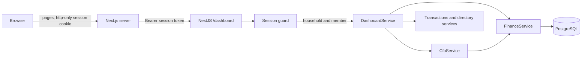

# Web dashboard

The dashboard is the household's view of its own finances in a browser: where the month stands, where the money went, how budgets and goals are doing, what is projected, and what the review says. It is read-only for financial data: the one thing it changes is the read mark on a notification. Transactions are recorded through WhatsApp.

Every figure on every page is calculated by the backend. The web application renders what it is given.



## Responsibilities

| Backend                                             | Web application                 |
| --------------------------------------------------- | ------------------------------- |
| Authentication and the household of a session       | Holding the session cookie      |
| Every amount, total, share, percentage and balance  | Rendering them                  |
| Which month a request means, and which months exist | Offering those months           |
| Comparisons, budget status, goal state, forecasts   | Layout and wording of labels    |
| Recurring expenses, anomalies, insights, the review | Empty, loading and error states |
| Formatting money and percentages as text            |                                 |
| Names for categories, accounts, members and goals   |                                 |

The web application contains no financial calculation, no threshold, no currency formatting and no date arithmetic. It does not import backend code other than the types of the API contract. Tests on both sides enforce this.

## Authentication and authorization

A member signs in with an access code and receives a session ([ADR-022](adr/ADR-022-dashboard-sessions.md)).

1. An operator issues an access code for a member. The code is shown once and only its hash is stored.
2. The member enters the code on the sign-in page. The Next.js server exchanges it with the API for a session token.
3. The token is set as an http-only, same-site cookie. Browser scripts cannot read it.
4. On every page request the Next.js server sends the token to the API as a bearer token.
5. The API's session guard resolves the token to a household and a member, the same request context the WhatsApp flow uses.

```sh
cd apps/api
HOUSEHOLD_NAME="Demo Household" MEMBER_NAME="Member A" npm run auth:issue-access-code
```

Issuing a new code for a member replaces the old one and ends that member's sessions. `npm run auth:revoke-access` removes a member's access altogether. Sessions last seven days and end on sign-out. Session tokens are stored as hashes. The full set of controls is in [security.md](security.md).

The browser never talks to the API directly and never holds an identifier.

- No endpoint accepts a household or member as a parameter. A `householdId` in a query string is ignored.
- The household comes only from the session, and every service call is scoped by it.
- Filter keys for transactions are looked up inside the session's household. A key from another household matches nothing.
- Members of a household see the same data. There is no private view.

## API

All routes require a session. All are `GET` and take an optional `month=YYYY-MM`, except the two notification routes.

| Route                                     | Returns                                                                                                                     |
| ----------------------------------------- | --------------------------------------------------------------------------------------------------------------------------- |
| `/dashboard/session`                      | Member and household names, currency, time zone, today, selectable months                                                   |
| `/dashboard/overview`                     | Totals, comparison, top categories, members, budgets, forecast, balances, findings                                          |
| `/dashboard/spending`                     | Total, categories, members, accounts, biggest changes, largest expenses                                                     |
| `/dashboard/income`                       | Total, sources, members, comparison                                                                                         |
| `/dashboard/budgets`                      | Each budget with usage, status, projection and member attribution                                                           |
| `/dashboard/goals`                        | Each goal with progress, remainder and state                                                                                |
| `/dashboard/outlook`                      | Forecast, cash-flow outlook, budgets projected over, recurring commitments                                                  |
| `/dashboard/signals`                      | Insights and anomalies, described                                                                                           |
| `/dashboard/review`                       | The monthly review narrative and whether it came from the model                                                             |
| `/dashboard/transactions`                 | A page of transactions, with filters `type`, `category`, `account`, `member`, `page`                                        |
| `/dashboard/accounts`                     | Accounts with balances and ownership, totals per currency, members                                                          |
| `/dashboard/recurring`                    | Recurring commitments per currency with totals, upcoming charges, price changes and stopped ones. Takes `sort`, not `month` |
| `/dashboard/notifications`                | The household's recent proactive notifications with status and read mark. Not tied to a month                               |
| `POST /dashboard/notifications/:key/read` | Marks one notification as read                                                                                              |

Sessions: `POST /auth/sessions` with an access code, and `DELETE /auth/sessions/current`.

### Contracts

Each response is a view written for the dashboard, defined as a Zod schema in `apps/api/src/dashboard/dashboard.contracts.ts`. `DashboardService` builds a response from service results and parses it against its schema before returning it, which both validates it and removes anything the schema does not name.

- An amount is `{ minor, text }`: the exact integer and its formatted text, such as `€2,220.00`.
- A ratio is `{ basisPoints, text }`, such as `82%`, or `null` when it does not exist.
- Categories, accounts, members and goals appear by name.
- Internal identifiers do not appear. The exception is the `key` of a transaction filter option, which the browser sends back to select a filter.

The web application imports the TypeScript types of these schemas and nothing else from the backend.

### Where the figures come from

`DashboardService` has no calculation of its own. Most views are slices of the monthly analysis that `CfoService` assembles from `FinanceService` ([cfo-intelligence.md](cfo-intelligence.md)). The review comes from `CfoService.monthlyReview`. Largest expenses, balances and the transaction list come from their services directly. Query parameters are validated with Zod, and a month that is malformed or has not started is rejected.

## Views

| Page         | Shows                                                                                                                                 |
| ------------ | ------------------------------------------------------------------------------------------------------------------------------------- |
| Overview     | The month in one line, comparison, findings, top categories, budgets, projection, balances, members                                   |
| Spending     | Total, categories with subcategories, members, accounts, risers and fallers, largest expenses                                         |
| Income       | Total, sources, members                                                                                                               |
| Budgets      | Usage, status, remainder, projection and who spent what                                                                               |
| Goals        | Progress, remainder, date and required monthly saving                                                                                 |
| Outlook      | Actual figures beside projected ones, budgets projected over, recurring commitments                                                   |
| Recurring    | Monthly and annual commitment, each recurring expense with cadence, dates, payers and price changes, and what appears to have stopped |
| Signals      | Insights by severity, unusual spending, and the notifications the CFO raised, with mark as read                                       |
| Review       | Summary, strengths, concerns, suggestions and priorities                                                                              |
| Transactions | Read-only history with filters and paging                                                                                             |
| Accounts     | Accounts, ownership, balances, totals per currency, members                                                                           |

## Periods

The month selector lists the months the backend says exist, from the current month back to the household's first transaction. Selecting one sets `?month=YYYY-MM`, which is carried across pages.

The backend decides what a month means. "Today" is the current date in the household's time zone. The current month covers the days up to today and has a forecast. A completed month covers all of its days and has none. A future month is refused. The web application checks only that the parameter looks like a month before passing it on.

Balances are current balances. They appear on the current month's overview and on the accounts page, and not on a past month.

## Currencies

Views that depend on currency return one entry per currency, and the pages render one section per entry. Nothing is added across currencies anywhere, and there is no conversion. With a single currency the grouping is invisible.

## Data fetching

Pages are rendered on the server on every request and fetch with caching disabled, so a page always reflects the database. A page makes one request for its view, and the layout makes one for the session.

There are no WebSockets and no polling. The Refresh button re-renders the current page, which is how a transaction just sent on WhatsApp appears.

The review page calls the language model each time it is opened, with a deterministic fallback. It has its own loading message.

## States

| State                          | Behaviour                                                                 |
| ------------------------------ | ------------------------------------------------------------------------- |
| Loading                        | A status message and skeletons. No figures                                |
| No data                        | A sentence saying what is absent, with no placeholder figures             |
| Not enough history             | "There is no earlier period to compare with yet" in place of a comparison |
| Not applicable                 | For example, no projection for a completed month, said in words           |
| API error                      | An error panel with a retry. No figures are shown                         |
| No session, or session refused | Redirect to the sign-in page                                              |
| Review without the model       | The deterministic review, labelled as the plain form                      |

## Running it

```sh
npm run start:dev --workspace apps/api
npm run dev --workspace apps/web
```

The web application runs on port 3001 and reads the API's address from `API_URL`, which defaults to `http://localhost:3000`.

## Limitations

- Read-only for financial data. There is no editing of transactions, budgets, goals or accounts. Marking a notification as read is the only write.
- Access codes are issued by an operator with a script. There is no self-service sign-up, code rotation screen or sign-in rate limiting yet.
- The review is generated on each visit and is not stored.
- Text produced by the API follows the household's language; the dashboard's own labels are covered by the web dictionary.
- Signals and findings are not persisted, so they are not marked as seen.
- Proportion bars are the only charts.
- Exercised end to end locally against the seeded demo household. The web tests render views from fixtures and do not drive a browser.
