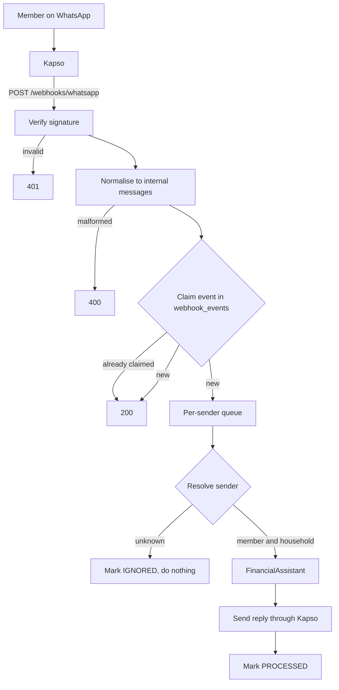
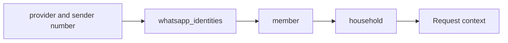

# WhatsApp integration

WhatsApp is the primary interface. Members write to one business number, [Kapso](https://kapso.ai) delivers each message to this application as a webhook, and replies go back through Kapso's API.



## Structure

```
apps/api/src/whatsapp
├── whatsapp-provider.ts            the WhatsAppProvider interface and internal message types
├── whatsapp-webhook.controller.ts  POST /webhooks/whatsapp
├── whatsapp-webhook.service.ts     authenticate, parse, claim, dispatch
├── webhook-events.repository.ts    the idempotency boundary
├── inbound-message-dispatcher.ts   background processing, one message at a time per sender
├── inbound-message-processor.ts    resolve the sender, call the assistant, reply
└── kapso
    ├── kapso-whatsapp-provider.ts  signature, payload parsing, sending text
    ├── kapso-media-source.ts       media download, implementing MediaSource
    └── kapso.module.ts
```

Everything outside `whatsapp/kapso` is provider-independent. An architecture test fails if Kapso is referenced anywhere else in the source, apart from configuration and the module list.

## The provider abstraction

```ts
interface WhatsAppProvider {
  readonly name: string;
  isAuthentic(request: WebhookRequest): boolean;
  parseWebhook(request: WebhookRequest): InboundMessage[];
  sendText(message: { to: string; text: string }): Promise<void>;
}
```

The interface covers what the application needs and nothing else: deciding whether a webhook is genuine, turning it into internal messages, and sending text. Media is reached through the separate `MediaSource` interface that image extraction already depends on ([vision-extraction.md](vision-extraction.md)).

An inbound message, once normalised, has six fields:

| Field        | Content                                                           |
| ------------ | ----------------------------------------------------------------- |
| `eventId`    | The identity of the event, used for idempotency                   |
| `deliveryId` | The provider's delivery key, kept for tracing                     |
| `messageId`  | The WhatsApp message identifier                                   |
| `sender`     | The sender's WhatsApp number as digits                            |
| `sentAt`     | When the message was sent, if the provider says                   |
| `content`    | Text, an image reference with an optional caption, or unsupported |

Nothing else from the provider payload survives parsing. Contact names, conversation records, provider URLs and any other field are dropped at the adapter. The assistant never sees a Kapso payload.

## Kapso

The adapter follows Kapso's published contract.

| Concern            | Contract                                                                                              |
| ------------------ | ----------------------------------------------------------------------------------------------------- |
| Webhook signature  | `X-Webhook-Signature`: hex-encoded HMAC-SHA256 of the raw request body, keyed with the webhook secret |
| Event name         | `X-Webhook-Event`, or `type` in a batched body                                                        |
| Events handled     | `whatsapp.message.received`. All others are acknowledged and ignored                                  |
| Payload version    | v2                                                                                                    |
| Batched deliveries | A body with `batch: true` and a `data` array is read item by item                                     |
| Sending            | `POST {base}/{phone_number_id}/messages` with `X-API-Key`                                             |
| Media lookup       | `GET {base}/{media_id}?phone_number_id=…` with `X-API-Key`, returning a `download_url`                |
| Media download     | `GET` on that `download_url`, which carries its own short-lived token                                 |
| Acknowledgement    | HTTP 200 within 10 seconds. Anything else is retried twice                                            |

The signature is checked against the exact bytes received, with a constant-time comparison. The application is started with raw body capture so that those bytes are available.

Messages addressed to a different business number than the configured one are ignored.

## Webhook responses

| Situation                                                          | Response | Kapso retries        |
| ------------------------------------------------------------------ | -------- | -------------------- |
| Missing or invalid signature                                       | 401      | Yes, and fails again |
| Authenticated but malformed payload                                | 400      | Yes, and fails again |
| Event of a type that is not handled                                | 200      | No                   |
| Duplicate event                                                    | 200      | No                   |
| Unknown sender                                                     | 200      | No                   |
| Unsupported message type                                           | 200      | No                   |
| Accepted for processing                                            | 200      | No                   |
| The event could not be claimed because the database is unavailable | 500      | Yes                  |

A request is acknowledged as soon as its events are claimed. Processing, which involves the model and can take longer than Kapso's ten-second limit, continues in the background. Once an event has been claimed, nothing that happens during processing changes the response, so a failure in the model, the media download, the database or the reply never causes Kapso to redeliver ([ADR-019](adr/ADR-019-webhook-processing.md)).

## Idempotency

`webhook_events` is the idempotency boundary. Claiming an event is one statement:

```sql
insert into webhook_events (provider, external_event_id) values (…)
on conflict do nothing returning id
```

The unique key on `(provider, external_event_id)` makes the claim atomic. Of any number of simultaneous deliveries of the same event, exactly one receives a row back and proceeds. The others are acknowledged and do nothing: no model call, no transaction, no reply.

The event identity is `whatsapp.message.received:<message id>`, not Kapso's `X-Idempotency-Key`. The delivery key identifies one delivery and is stable across its retries, but Kapso redelivers the messages of a failed batch individually, under new keys. Keying on the message means a message is processed once however it arrives. The delivery key is still read and kept on the normalised message.

An event is in one of four states:

| Status      | Meaning                                    |
| ----------- | ------------------------------------------ |
| `RECEIVED`  | Claimed, processing not finished           |
| `PROCESSED` | Handled, and a reply was attempted         |
| `IGNORED`   | Unknown sender or unsupported message type |
| `FAILED`    | Processing broke unexpectedly              |

A claimed event is never processed again, whatever its final state. That is deliberate: a retry of a half-finished event could record a transaction twice. An event left in `RECEIVED` by a crash, or in `FAILED`, is visible in the table and is not retried automatically.

The transaction-level check on `source_message_id` from image extraction remains as a second line of defence. It is not what makes webhooks idempotent.

## Identity resolution



The sender is resolved by lookup before anything else happens to the message ([ADR-007](adr/ADR-007-whatsapp-identity-resolution.md)). The lookup key is the provider name and the sender's number as digits, which is how identities are seeded.

The resulting context, household and member, is the only source of identity for everything downstream. The payload is parsed with a schema that keeps six fields, so a `household_id`, `member_id` or `account_id` placed anywhere in a webhook is discarded before any application code sees it.

### Unknown senders

A message from a number with no registered identity is acknowledged with 200 and then:

- no model is called
- the finance engine is not called
- no transaction is created
- no media is downloaded
- no reply is sent
- the event is marked `IGNORED`
- one log line records `reason=unknown-sender`, without the number or the message

The same applies to a number registered under a different provider.

## Text flow

```
text message → resolved context → FinancialAssistant.handle → reply → sendText
```

The assistant is the same one described in [ai-integration.md](ai-integration.md). The webhook layer passes it the context, the text and the WhatsApp message identifier, and sends back whatever it replies. No financial logic exists in the WhatsApp layer.

## Image flow

```
image message → resolved context → FinancialAssistant.handleImage → ImageTransactionService → reply → sendText
```

The adapter turns an image message into a media reference, `{ provider: "kapso", mediaId }`, and a caption. The addresses Kapso includes in the payload are discarded.

When the image is needed, `KapsoMediaSource` resolves the identifier through Kapso's API and downloads the file into the temporary directory that image extraction manages. It refuses a download address on any host other than the configured API, refuses media declared larger than the limit, stops a stream that exceeds the limit, and does not follow redirects. The image is deleted as soon as it has been read.

## Ordering

Messages from one sender are processed one at a time, in the order they were accepted, so a reply to a clarifying question is never interpreted before the question it answers. Different senders are processed in parallel.

The queue is in memory. On shutdown the application waits for messages in flight to finish.

## Time

When Kapso provides the time a message was sent, that time decides which day the message belongs to, so a message sent just before midnight and delivered just after is recorded on the day it was sent. A sent time in the future is not trusted and the time of receipt is used.

## Failures

| Failure                                      | What the member receives                     | Event status | Recorded                                       |
| -------------------------------------------- | -------------------------------------------- | ------------ | ---------------------------------------------- |
| Model unavailable or returned invalid output | A message asking them to try again           | `PROCESSED`  | Nothing                                        |
| Image could not be downloaded or used        | A message saying the image could not be used | `PROCESSED`  | Nothing                                        |
| Reply could not be delivered                 | Nothing                                      | `PROCESSED`  | Whatever was recorded stays recorded           |
| Unexpected error during processing           | A general apology                            | `FAILED`     | Nothing, unless the error came after the write |

Outbound messages are sent once and not retried, so a member never receives the same reply twice.

Errors from Kapso, the model and the database are never included in a reply.

## Configuration

| Variable                    | Required | Default                                    | Purpose                                                         |
| --------------------------- | -------- | ------------------------------------------ | --------------------------------------------------------------- |
| `KAPSO_API_KEY`             | Yes      |                                            | Project API key, sent as `X-API-Key`                            |
| `KAPSO_WEBHOOK_SECRET`      | Yes      |                                            | Secret used to verify webhook signatures                        |
| `KAPSO_PHONE_NUMBER_ID`     | Yes      |                                            | The WhatsApp phone number identifier of the assistant's number  |
| `KAPSO_API_BASE_URL`        | No       | `https://api.kapso.ai/meta/whatsapp/v24.0` | Base of Kapso's WhatsApp API. Must be HTTPS                     |
| `WHATSAPP_WELCOME_TEMPLATE` | No       | Empty                                      | Name of the approved welcome template. Empty turns welcomes off |

In Kapso, create a webhook for the phone number of kind "Kapso webhook", payload version v2, subscribed to `whatsapp.message.received`, pointing at `https://<host>/webhooks/whatsapp`. Its secret is `KAPSO_WEBHOOK_SECRET`.

Each member's number is registered in `whatsapp_identities` with provider `kapso` and the number as digits, through the seed definition ([database.md](database.md)).

## Welcome template

A person registered by a platform admin is welcomed with an approved template as soon as their number is saved ([ADR-034](adr/ADR-034-whatsapp-welcome-template.md)). Register it in Kapso under one name, with a body in each language and a single variable, the person's first name:

| Field    | Value                                         |
| -------- | --------------------------------------------- |
| Name     | `boas_vindas` (any lowercase name works)      |
| Category | Utility                                       |
| Language | Portuguese (BR), `pt_BR`, and English, `en`   |
| Variable | `{{1}}`, the person's first name, such as Ana |

Portuguese (BR):

```text
Olá, {{1}}! Eu sou o assessor financeiro da sua família aqui no WhatsApp.

Comigo você registra gastos e receitas só mandando mensagem, como "gastei 45 no mercado", ou uma foto do recibo. Eu organizo tudo por categoria, acompanho orçamentos e metas e aviso quando algo merece atenção.

Também respondo perguntas como "quanto gastamos com restaurantes este mês?".

Para começar, é só me mandar o seu primeiro gasto.
```

English:

```text
Hi {{1}}! I'm your household's financial assistant here on WhatsApp.

You can record spending and income just by messaging me, like "spent 45 at the supermarket", or by sending a photo of a receipt. I sort everything into categories, keep track of budgets and goals, and let you know when something needs attention.

I also answer questions like "how much did we spend on restaurants this month?".

To get started, just send me your first expense.
```

Once Meta approves it, set `WHATSAPP_WELCOME_TEMPLATE` to its name. A template Meta has not approved, or a name that does not match, makes the send fail; the number stays saved and the dashboard offers to send the welcome again.

## Local development and testing

The normal test suites need no Kapso account and make no external calls.

- The adapter is tested against a small local HTTP server that stands in for Kapso's API.
- `test/whatsapp-webhook.int-spec.ts` starts the whole application with that stand-in, a fake AI provider and a real PostgreSQL, and posts signed webhooks to it.

To exercise the endpoint by hand, sign a body with the secret from your environment:

```sh
BODY='{"message":{"id":"wamid.local-1","type":"text","from":"12025550101","text":{"body":"Gastei 23 no Lidl"}},"phone_number_id":"000000000000000"}'
SIGNATURE=$(printf '%s' "$BODY" | openssl dgst -sha256 -hmac "$KAPSO_WEBHOOK_SECRET" -hex | sed 's/^.* //')
curl -i http://localhost:3000/webhooks/whatsapp \
  -H 'Content-Type: application/json' \
  -H 'X-Webhook-Event: whatsapp.message.received' \
  -H "X-Webhook-Signature: $SIGNATURE" \
  -d "$BODY"
```

With placeholder credentials the message is accepted and processed, and the calls to OpenAI and Kapso fail gracefully.

To receive real webhooks on a development machine, expose the port through a tunnel and use the tunnel's HTTPS address in Kapso.

## Security

- Unauthenticated requests are rejected before the payload is interpreted.
- Signatures are compared in constant time against the raw body.
- The household and member come only from identity resolution. Nothing in a payload can select them.
- Replies are sent only to the number the message came from.
- The API key is sent only to the configured API host. The media download request carries no API key.
- Media is fetched only by identifier and only from the configured host.
- Logs contain the provider name, an event category and an outcome. They contain no message text, amount, merchant, account, phone number, message identifier, media identifier or credential.
- Secrets are read from the environment and validated at startup. The repository contains placeholders only.

## Limitations

- Not exercised against Kapso's live service in this repository. The adapter implements the documented contract and is verified against a local stand-in.
- Media downloads do not follow redirects. If Kapso's download address redirects to another host, image messages will be reported as unusable and this choice will need revisiting.
- Only text and image messages are handled. Other types are ignored without a reply.
- An event that fails or is interrupted is not retried automatically.
- The per-sender queue is in memory, which is sufficient for one process.
- The only template is the welcome. Replies answer a message just received, which is always inside the 24-hour window. Proactive notifications are still free-form and fail outside it.
